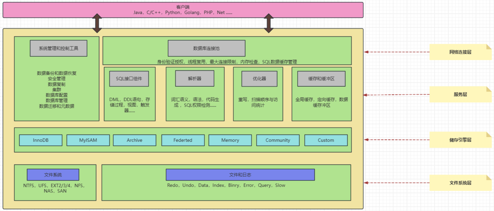

# mysql体系结构原理

## 1.mysql体系结构

- 从上往下看，依次会分为网络连接层、系统服务层、存储引擎层、以及文件系统层，往往编写SQL后，都会遵守着MySQL的这个架构往下走。
  1. 连接层：主要是指数据库连接池，会负责处理所有客户端接入的工作。
  2. 服务层：主要包含SQL接口、解析器、优化器以及缓存缓冲区四块区域。
  3. 存储引擎层：这里是指MySQL支持的各大存储引擎，如InnoDB、MyISAM等。
  4. 文件系统层：涵盖了所有的日志，以及数据、索引文件，位于系统硬盘上。

## 2.mysql整体结构分析

### 2.1.网络连接层

- 最上层是一些客户端和链接服务，包含本地sock 通信和大多数基于客户端/服务端工具实现的类似于TCP/IP的通信。主要完成一些类似于连接处理、授权认证、及相关的安全方案。在该层上引入了线程池的概念，为通过认证安全接入的客户端提供线程。同样在该层上可以实现基于SSL的安全链接。服务器也会为安全接入的每个客户端验证它所具有的操作权限。

### 2.2.服务层

- 第二层架构主要完成大多数的核心服务功能，如SQL接口，并完成缓存的查询，SQL的分析和优化，部分内置函数的执行。所有跨存储引擎的功能也在这一层实现，如过程、函数等。在该层，服务器会解析查询并创建相应的内部解析树，并对其完成相应的优化如确定表的查询的顺序，是否利用索引等，最后生成相应的执行操作。

### 2.2.1.SQL 接口

- 主要作用就是负责处理客户端的`SQL`语句，当客户端连接建立成功之后，会接收客户端的`SQL`命令，比如`DML、DDL`语句以及存储过程、触发器等，当收到`SQL`语句时，`SQL`接口会将其分发给其他组件，然后等待接收执行结果的返回，最后会将其返回给客户端。简单来说，也就是`SQL`接口会作为客户端连接传递`SQL`语句时的入口，并且作为数据库返回数据时的出口。
- 在`SQL`中会分为五大类：
  1. `DML`：数据库操作语句，比如`update、delete、insert`等都属于这个分类。
  2. `DDL`：数据库定义语句，比如`create、alter、drop`等都属于这个分类。
  3. `DQL`：数据库查询语句，比如最常见的`select`就属于这个分类。
  4. `DCL`：数据库控制语句，比如`grant、revoke`控制权限的语句都属于这个分类。
  5. `TCL`：事务控制语句，例如`commit、rollback、setpoint`等语句属于这个分类。

### 2.2.2.解析器

- 客户端连接发送的`SQL`语句，经过`SQL`接口后会被分发到解析器，解析器的作用主要是做词法分析、语义分析、语法树生成等等。主要是为了验证`SQL`语句是否正确，以及将`SQL`语句解析成`MySQL`能看懂的机器码指令。
  1. **语法分析**：解析器首先对输入的SQL语句进行语法分析（Syntax Analysis），检查语句是否符合SQL语法规则。如果语句中有语法错误，解析器会返回相应的错误信息。  
  2. **语义分析**： 在语法分析通过之后，解析器进行语义分析（Semantic Analysis）。它会检查表、列、视图等对象是否存在，以及用户是否有权限访问这些对象。  
  3. **生成解析树**：  解析器会将SQL语句转换成解析树（Parse Tree）或抽象语法树（Abstract Syntax Tree, AST），这是一个树状的数据结构，表示SQL语句的结构和组成部分。解析树是后续查询优化和执行的基础。 

### 2.2.3.优化器

- 解析器完成相应的词法分析、语法树生成....等一系列工作后，紧接着会来到优化器，优化器的主要是决定如何最有效地执行SQL查询，比如选择最合适的索引，选择最合适的`join`方式等，根据查询语句和数据库的状态生成多种可能的执行计划，最终会选择出一套最优的执行计划。
- 优化器生成了执行计划后，维护当前连接的线程会负责根据计划去执行`SQL`，这个执行的过程实际上是在调用存储引擎所提供的`API`。

### 2.2.4.缓存和缓存冲区

#### 2.2.4.1.缓存（Cache）

- 主要分为了读取缓存与写入缓冲，读取缓存主要是指`select`语句的数据缓存，也会包含一些权限缓存、引擎缓存等信息，但主要还是`select`语句的数据缓存，`MySQL`会对于一些经常执行的查询`SQL`语句，将其结果保存在`Cache`中，因为这些`SQL`经常执行，因此如果下次再出现相同的`SQL`时，能从内存缓存中直接命中数据，自然会比走磁盘效率更高。对于`Cache`是否开启可通过命令查询。
- 存储查询的结果集。如果相同的查询再次执行，MySQL可以直接从缓存中返回结果，而不必重新解析、优化和执行查询。
- 缓存表和索引数据，减少磁盘I/O操作。

~~~sql
--对于Cache是否开启可通过命令查询。同时还可以通过show status like'%Qcache%';命令查询缓存相关的统计信息。

show global variables like "%query_cache_type%"; --查询缓存是否开启。
show global variables like "%query_cache_size%"; --查询缓存的空间大小。
~~~

#### 2.2.4.2.缓存冲区（Buffer）

> PS 高版本的 MySQL 移除了查询缓存区，但并未移除缓冲区，这是两个概念.

- 缓冲区的设计主要是**为了通过内存的速度来弥补磁盘速度较慢对数据库造成的性能影响**。在数据库中读取某页数据操作时，会先将从磁盘读到的页存放在缓冲区中，后续操作相同页的时候，可以基于内存操作。
- 一般来说，对数据库进行写操作时，都会先从缓冲区中查询是否有你要操作的页，如果有，则直接对内存中的数据页进行操作（例如修改、删除等），对缓冲区中的数据操作完成后，会直接给客户端返回成功的信息，然后`MySQL`会在后台利用一种名为`Checkpoint`的机制，将内存中更新的数据刷写到磁盘。
- `MySQL`在设计时，通过缓冲区能减少大量的磁盘`IO`，从而进一步提高数据库整体性能。毕竟每次操作都走磁盘，性能自然上不去的。
- 缓冲区是与存储引擎有关的，不同的存储引擎实现也不同，比如`InnoDB`的缓冲区叫做`innodb_buffer_pool`，而`MyISAM`则叫做`key_buffer`。

### 2.3.储存引擎层

- `MySQL`为了能够正常搭载不同的存储引擎运行，因此引擎层是被设计成可拔插式的，也就是可以根据业务特性，为自己的数据库选择不同的存储引擎。
-  负责数据的实际存储、检索和管理。  也会负责库表管理、索引管理等，`MySQL`中所有与磁盘打交道的工作，最终都会交给存储引擎来完成。

### 2.4.文件系统层

- 是基于机器物理磁盘的一个文件系统，其中包含了配置文件、库表结构文件、数据文件、索引文件、日志文件等各类`MySQL`运行时所需的文件，也就是与上层的存储引擎做交互，负责数据的最终存储与持久化工作。

#### 2.4.1. 日志模块

- 在`MySQL`中主要存在七种常用的日志类型，如下：
  1. `binlog`：二进制日志，主要记录`MySQL`数据库的所有写操作（增删改）。
  2. `redo-log`：重做/重写日志，`MySQL`崩溃时，对于未落盘的操作会记录在这里面，用于重启时重新落盘（`InnoDB`专有的）。
  3. `undo-logs`：撤销/回滚日志：记录事务开始前[修改数据]的备份，用于回滚事务。
  4. `error-log`：错误日志：记录`MySQL`启动、运行、停止时的错误信息。
  5. `general-log`常规日志，主要记录`MySQL`收到的每一个查询或`SQL`命令。
  6. `slow-log`：慢查询日志，主要记录执行时间较长的`SQL`。
  7. `relay-log`：中继日志，主要用于主从复制做数据拷贝。

#### 2.4.2.数据模块

- `MySQL`的所有数据最终都会落盘（写入到磁盘），而不同的数据在磁盘空间中，存储的格式也并不相同，`MySQL`中常见的数据文件类型：
  1. `.db.opt`文件：主要记录当前数据库使用的字符集和验证规则等信息。
  2. `.frm`文件：存储表结构的元数据信息文件，每张表都会有一个这样的文件。
  3. `.MYD`文件：用于存储表中所有数据的文件（`MyISAM`引擎独有的）。
  4. `.MYI`文件：用于存储表中索引信息的文件（`MyISAM`引擎独有的）。
  5. `.ibd`文件：用于存储表数据和索引信息的文件（`InnoDB`引擎独有的）。
  6. `.ibdata`文件：用于存储共享表空间的数据和索引的文件（`InnoDB`引擎独有）。
  7. `.ibdata1`文件：这个主要是用于存储`MySQL`系统（自带）表数据及结构的文件。
  8. `.ib_logfile0/.ib_logfile1`文件：用于故障数据恢复时的日志文件。
  9. `.cnf/.ini`：`MySQL`的配置文件，`Windows`下是`.ini`，其他系统大多为`.cnf`。
  10. `......`

