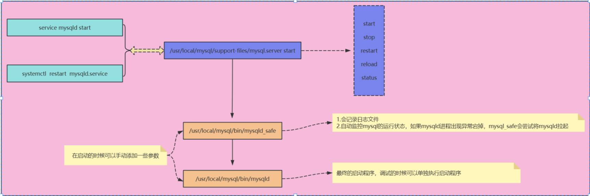

# mysql启动流程

## 1.启动说明

1. /etc/init.d/mysqld 是一个普通的shell脚本和/usr/local/mysql/support-file/mysql.server一模一样，提供了日常的启动，关闭，重启，查看状态等功能。
2. /etc/init.d/mysqld 启动时调用的是/usr/local/mysql/bin/mysqld_safe
   - mysqld_safe简介
     - 会记录启动等相关日志信息到文件中
     - 会自动监控mysqld的运行状态，如果mysqld进程出现异常宕掉，mysqld_safe会尝试拉起mysqld
3. /usr/local/mysql/bin/mysqld_safe（也是shell脚本） 调用的是真正的启动程序/usr/local/mysql/bin/mysqld
   - mysqld 简介
     - 可以单独启动，默认会把启动的相关流程日志信息全部输出到屏幕上，会很混乱
     - 该启动方法没有带关闭功能，可以使用如下关闭方法：
       1. 登录到MySQL中，执行：mysql> shutdown;
       2. mysqladmin -uroot -p -S /tmp/mysql.sock shutdown
     - 数据库启动不了，且未记录日志的时候，可以使用该启动方法

## 2.关闭说明

1. systemctl stop mysqld 只能关闭 systemctl start mysqld方式启动的实例。
2. /etc/init.d/mysqld stop 除了无法关闭"mysqld &" 方式启动的，其他方式启动的都可以关闭，可以登录到MySQL中，执行shutdown; 进行关闭，也可以使用 mysqladmin 方法进行关闭。
3. mysqld_safe方式启动，可以使用/etc/init.d/mysqld stop方法进行关闭，也可以使用mysqladmin方法进行关闭

## 3.总结

### 3.1.关系概述1

1. mysqld：MySQL的主程序，也就是MySQL服务器进程。当你启动MySQL时，mysqld 进程会在后台运行，处理所有的数据库请求。
2. mysqld_safe： MySQL 的安全启动脚本。它负责启动 mysqld，并在 mysqld 崩溃时自动重新启动它。此外，它还可以记录错误日志并设置某些环境变量。
3. mysql.server：通用的启动脚本，通常位于 /etc/init.d/ 或 /usr/share/mysql/ 目录下。它通过调用 mysqld_safe 来启动 MySQL 服务器，并支持启动、停止、重启和检查状态等操作。
4. /etc/init.d/mysqld：这是传统的SysV init脚本，用于在没有 systemd 的系统上管理MySQL服务。它通常是 mysql.server 的一个链接或包装。
5. systemd：是系统和服务管理器。

### 3.2.关系概述2

1. systemd 启动 MySQL：当执行 systemctl start mysqld 时，systemd 会读取对应的 mysqld.service 文件。该 service 文件定义了启动 MySQL 所需的命令和参数，通常会调用 mysqld 或 mysqld_safe。systemd 会管理 MySQL 服务的生命周期，包括启动、停止、重启和状态检查等操作。
2. /etc/init.d/mysqld 启动 MySQL：在没有 systemd 的系统上，可以使用 /etc/init.d/mysqld start 来启动 MySQL。会调用 mysql.server 脚本。mysql.server 会进一步调用 mysqld_safe，然后 mysqld_safe 最终启动 mysqld 进程。
3. mysqld_safe 启动 MySQL：可以直接运行 mysqld_safe 来启动 MySQL。mysqld_safe 会设置一些环境变量，检查并创建必要的目录和文件，然后启动 mysqld 进程。如果 mysqld 进程崩溃，mysqld_safe 会尝试重新启动它。

|          启动方式           |               **关闭方式**                |
| :-------------------------: | :---------------------------------------: |
|          mysqld &           | kill/pkill/killall (不建议) kill -9 禁用  |
|        mysqld_safe &        |        kill/pkill/killall (不建议)        |
|     mysql.server start      |             mysql.server stop             |
| service mysqld start (建议) |        service mysqld stop (建议)         |
|   systemctl start mysqld    |           systemctl stop mysqld           |
|                             |                > shutdown                 |
|                             | mysqladmin -S  /tmp/mysql.sock   shutdown |

- `mysqld` 是 MySQL 的核心服务进程。
- `mysqld_safe` 是一个安全启动脚本，用于启动并监控 `mysqld`。
- `mysql.server` 是一个启动脚本，通常用于调用 `mysqld_safe`来启动 MySQL。
- `/etc/init.d/mysqld` 是传统的启动脚本，可以调用 `mysql.server`。
- `systemd` 使用 `mysqld.service` 文件来管理 MySQL 服务。