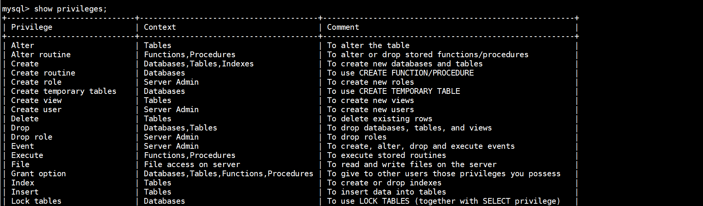

# mysql用户权限管理

## 1.权限级别

- 官方网址：https://dev.mysql.com/doc/refman/8.4/en/creating-accounts.html
- `CREATE USER`以及 `DROP USER`创建和删除帐户。
- `GRANT`并向 `REVOKE`账户分配权限和撤销权限。
- `SHOW GRANTS`显示帐户权限分配。

>INSERT 不建议使用诸如、 UPDATE 或 之 类的语句直接修改授权表 DELETE，这样做的风险由您自行承担。服务器可以自由地忽略由于此类修改而变得格式错误的行。

## 2.创建帐户并授予权限

- 连接到服务器后，您可以添加新帐户。以下示例使用CREATE USER和GRANT语句设置四个帐户（在看到的地方 ，请替换为适当的密码）： '*password*'

~~~sql
create user admindb@'21.4.61.%' identified by 'gfgdb123!';
create user appsdb@'21.4.61.%' identified by 'gfgdb123!';

##WITH GRANT OPTION: 允许 admindb 用户将这些权限授予其他用户。一般不建议添加
GRANT ALL ON *.* TO admindb@'21.4.61.%' WITH GRANT OPTION; 
GRANT RELOAD,PROCESS ON *.* TO appsdb@'21.4.61.%';
~~~

### 2.1.权限范围

~~~sql
#1
GRANT ALL ON *.* TO admindb@'21.4.61.%'; 

#2
GRANT SELECT,INSERT,UPDATE,DELETE,CREATE,DROP ON db.table TO admindb@'21.4.61.%';

#3
GRANT SELECT,INSERT,UPDATE,DELETE,CREATE,DROP ON db.* TO admindb@'21.4.61.%';
~~~

## 3.检查帐户权限和属性

- 要查看帐户的权限，请使用 SHOW GRANTS：

~~~sql
SHOW GRANTS FOR 'admin'@'localhost';
~~~

- 要查看帐户的非特权属性，请使用 SHOW CREATE USER：

~~~sql
mysql> SET print_identified_with_as_hex = ON;
mysql> SHOW CREATE USER 'admin'@'localhost'\G
*************************** 1. row ***************************
CREATE USER for admin@localhost: CREATE USER `admin`@`localhost`
IDENTIFIED WITH 'caching_sha2_password'
AS 0x24412430303524301D0E17054E2241362B1419313C3E44326F294133734B30792F436E77764270373039612E32445250786D43594F45354532324B6169794F47457852796E32
REQUIRE NONE PASSWORD EXPIRE DEFAULT ACCOUNT UNLOCK
PASSWORD HISTORY DEFAULT
PASSWORD REUSE INTERVAL DEFAULT
PASSWORD REQUIRE CURRENT DEFAULT
~~~

- 启用 print_identified_with_as_hex 系统变量会导致SHOW CREATE USER包含不可打印字符的哈希值显示为十六进制字符串而不是常规字符串文字。

## 4.撤销账户权限

- 要撤销帐户权限，请使用该 REVOKE语句。权限可以在不同级别被撤销，就像权限可以在不同级别被授予一样。
- 撤销全局权限：

~~~sql
REVOKE ALL
  ON *.*
  FROM 'finley'@'%.example.com';

REVOKE RELOAD
  ON *.*
  FROM 'admin'@'localhost';
~~~

- 撤销数据库级权限：

~~~sql
REVOKE CREATE,DROP
  ON expenses.*
  FROM 'custom'@'host47.example.com';
~~~

- 撤销表级权限：

~~~sql
REVOKE INSERT,UPDATE,DELETE
  ON customer.addresses
  FROM 'custom'@'%.example.com';
~~~

## 5.生产中用户类型规范

~~~
管理员 : ALL

开发 : Create ,Create routine,Create temporary tables,Create view,Show view,Delete ,Event ,Execute,Insert ,References,Select,Trigger,Update,dev_g_role

监控 : select , replication slave , client supper

备份 : Select 、SHOW DATABASES、 PROCESS LOCK TABLES 、RELOAD

主从 : replication slave replication client

业务 : insert , update , delete ,select
~~~

