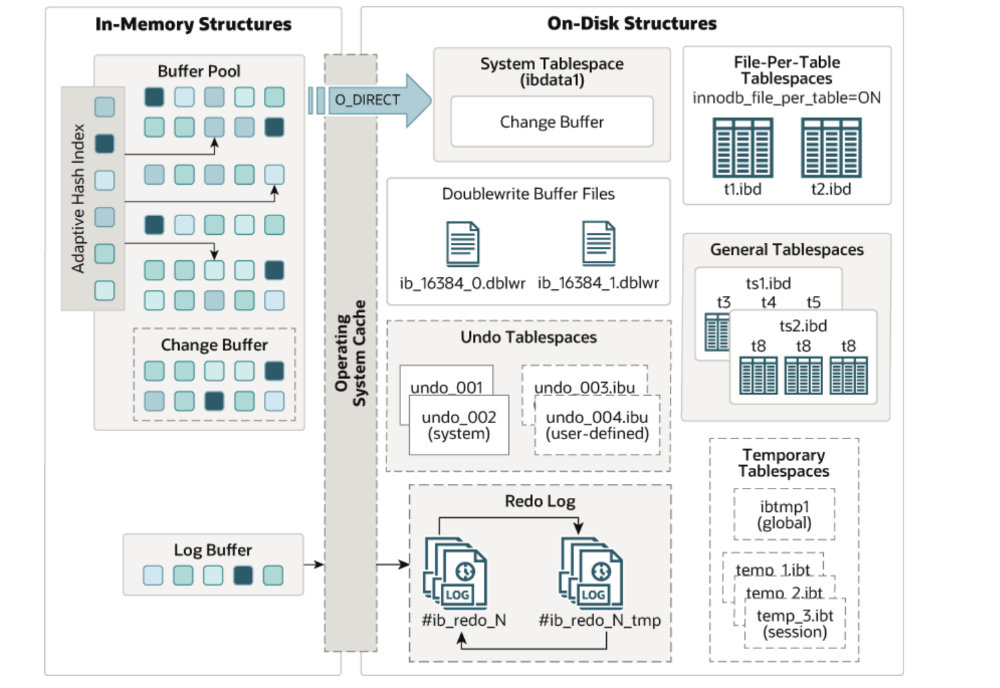

# InnoDB储存引擎

## 1.数据库存储引擎概念

1. 概念：数据库存储引擎是数据库管理系统（DBMS）中负责数据存储、检索和管理的组件。不同的存储引擎提供不同的功能、性能特性和支持的事务模型。
2. 种类：
   - InnoDB：支持事务、行级锁、外键，具有崩溃恢复能力。高并发、数据一致性要求高的应用。
   - MyISAM：不支持事务，仅支持表级锁，性能较高，适合读操作。以读取为主的应用，数据完整性要求不高。
   - Memory：数据存储在内存中，速度快，数据在重启后丢失。临时数据或缓存，快速查询。
   - CSV：将数据存储为 CSV 文件，便于数据交换。需要与其他系统交换数据的场景。
3. 在实际场景中，99.9%都是使用innodb存储引擎，并且在最新版8.0数据库中，所有mysql数据库中的表对应的引擎也都改为了innodb。

~~~sql
mysql> show engines;
~~~

## 2.InnoDB存储引擎核心特性

1. InnoDB架构图
2. https://dev.mysql.com/doc/refman/8.0/en/innodb-architecture.html

>1. 事务支持
>   - **ACID 特性**：InnoDB 支持原子性、一致性、隔离性和持久性（ACID），确保数据的完整性。
>   - **自动提交**：默认情况下，InnoDB 以自动提交模式运行，但可以显式使用事务块。
>2. 行级锁
>   - InnoDB 提供行级锁，而不是表级锁，提高了并发性能，允许多个事务同时更新不同的行而不发生冲突。
>3. 外键支持
>   - 支持外键约束，确保数据之间的参照完整性，使得可以定义表之间的关系。
>4. MVCC（多版本并发控制）
>   - 使用多版本并发控制来提供非阻塞读，提高并发性能，允许读操作不阻塞写操作。
>5. 自适应哈希索引
>   - InnoDB 可以在内存中自动创建哈希索引，以加速常见的查询，提高性能。
>6. 崩溃恢复
>   - InnoDB 具有自动崩溃恢复机制，通过重做日志（redo log）和撤销日志（undo log）确保数据在系统崩溃后的完整性。

## 3.与其他存储引擎区别

InnoDB 存储引擎与其他常见存储引擎（如 MyISAM、Memory 等）相比，有以下几个显著区别：

1. 事务支持
   - **InnoDB**：支持事务，遵循 ACID 特性。
   - **MyISAM**：不支持事务，所有操作都是立即生效的。
   - **Memory**：不支持事务，数据存储在内存中，速度快但易丢失。
2. 锁机制
   - **InnoDB**：使用行级锁，允许高并发操作，减少锁争用。
   - **MyISAM**：使用表级锁，可能导致高并发时性能下降。
   - **Memory**：同样使用表级锁，适合读操作但不适合高写并发。
3. 外键支持
   - **InnoDB**：支持外键约束，确保数据的参照完整性。
   - **MyISAM**：不支持外键，无法直接维护表之间的关系。
   - **Memory**：不支持外键，无法维护数据完整性。
4. 崩溃恢复
   - **InnoDB**：具有崩溃恢复功能，利用重做日志和撤销日志确保数据安全。
   - **MyISAM**：没有崩溃恢复机制，数据损坏后难以恢复。
   - **Memory**：数据存储在内存中，重启后数据会丢失。
5. 数据存储方式
   - **InnoDB**：支持共享表空间和独立表空间，使用 16KB 的数据页。
   - **MyISAM**：将数据和索引分别存储在 .MYD 和 .MYI 文件中。
   - **Memory**：数据存储在内存中，速度极快，但不持久化。
6. 适用场景
   - **InnoDB**：适合需要高并发、事务支持和数据完整性的应用（如金融系统）。
   - **MyISAM**：适合以读取为主的应用，不需要事务或外键的场景（如数据仓库）。
   - **Memory**：适合需要快速访问的临时数据或缓存（如会话管理）。

## 4.存储引擎管理

1. 查询支持的存储引擎

~~~sql
-- 查询所有可用的存储引擎种类
mysql> show engines;

-- 查询、设置默认存储引擎
mysql> select @@default_storage_engine;
+--------------------------+
| @@default_storage_engine |
+--------------------------+
| InnoDB                   |
+--------------------------+

-- 配置文件永久设置默认
vim /etc/my.cnf
default_storage_engine=InnoDB
~~~

2. 查看某张表的存储引擎

~~~sql
-- 查询表创建工程
mysql> show create table t1;

-- 查询系统中所有业务表的存储引擎信息
mysql> select
    table_schema,
    table_name ,
    engine
    from information_schema.tables
    where table_schema not in
('sys','mysql','information_schema','performance_schema');
+--------------+------------+--------+
| TABLE_SCHEMA | TABLE_NAME | ENGINE |
+--------------+------------+--------+
| test_db      | account    | InnoDB |
| test_db      | t1         | InnoDB |
+--------------+------------+--------+

-- 巡检需求： 将业务表中所有非InnoDB查询出来
mysql> select table_schema,table_name,engine from information_schema.tables
where table_schema not in
('mysql','sys','information_schema','performance_schema') and engine !='innodb';
Empty set (0.00 sec)
~~~

3. 创建表设定存储引擎

~~~sql
mysql> create table xxx (id int) engine=innodb charset=utf8mb4;

-- 修改已有表的存储引擎
mysql> alter table world.xxx engine=innodb;
~~~

4. 将所有的非InnoDB引擎的表查询出来，批量修改为InnoDB

~~~sql
-- 客户案例：将历史遗留下的非InnoDB表进行处理

-- 1. 1.查询所有非InnoDB表
mysql> select table_schema,table_name ,engine
    from information_schema.tables
    where
    table_schema not in ('sys','mysql','information_schema','performance_schema')
and engine !='innodb';

-- 2. 备份所有非InnoDB表
mysql> SELECT CONCAT("mysqldump -uroot -p123 ", table_schema, " ", table_name, " > /tmp/", table_schema, "_", table_name, ".sql")
    FROM information_schema.tables
    WHERE table_schema NOT IN ('sys', 'mysql', 'information_schema', 'performance_schema')
    AND engine != 'innodb';
    
-- 3. 修改存储引擎
mysql> SELECT CONCAT("ALTER TABLE ", table_schema, ".", table_name, " ENGINE=InnoDB;")
     FROM information_schema.tables
     WHERE table_schema NOT IN ('sys', 'mysql', 'information_schema', 'performance_schema')
     AND engine != 'InnoDB'
     INTO OUTFILE '/tmp/a.sql';
     
-- 4. 执行a.sql文件
mysql> source /tmp/a.sql
~~~

