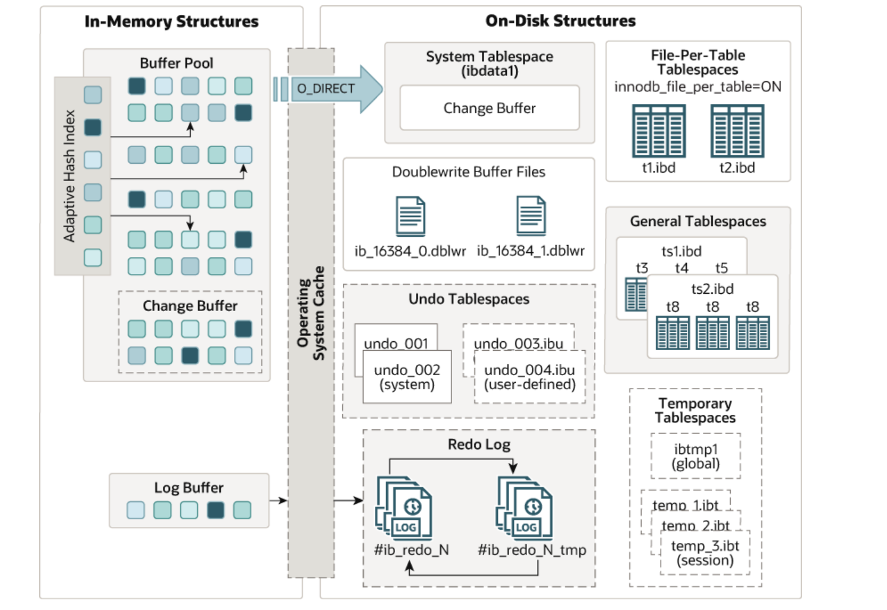

#  InnoDB体系结构

## 1.内存结构（ In-Memory Structures）

### 1.1.Buffer Pool（缓冲池）

1. **概念**：
   - 缓冲池是主内存中的一个区域，里面可以缓存磁盘上经常操作的真实数据，主要用来缓冲或缓存数据库服务的数据页和索引页。在执行增删改查操作时，先操作缓冲池中的数据(若缓冲池没有数据，则从磁盘加载并缓存)，然后再以一定频率刷新到磁盘，从而减少磁盘10，加快处理速度。
   - 缓冲池以Page页为单位，底层采用链表数据结构管理Page。根据状态，将Page分为三种类型:
     - free page:空闲page，未被使用。
     - clean page:被使用page，数据没有被修改过。
     - dirty page:脏页，被使用page，数据被修改过，也中数据与磁盘的数据产生了不一致。

#### 1.1.1.Buffer Pool内存空间管理

~~~sql
-- 1、Buffer Pool配置参数信息查看，buffer pool默认内存空间大小为128M，生产建议大小可以设置为物理内存总量的50%~80%
mysql> select @@innodb_buffer_pool_size;
+---------------------------+
| @@innodb_buffer_pool_size |
+---------------------------+
|                 134217728 |
+---------------------------+

-- 2、InnoDB 存储引擎当前仅使用一个缓冲池实例。
mysql> select @@innodb_buffer_pool_instances;
+--------------------------------+
| @@innodb_buffer_pool_instances |
+--------------------------------+
|                              1 |
+--------------------------------+

-- 3、Buffer Pool配置参数修改方法
# 配置信息临时调整，配置调整后，重新登录mysql数据库生效
mysql > set global innodb_buffer_pool_size=268435456;

# 配置信息永久调整，配置调整后，重新启动mysql数据库生效
root@mysql-db111 /root # vim /etc/my.cnf
[mysqld]
innodb_buffer_pool_size=256M

mysql> show global status like '%innodb%wait%';
~~~

>:bell:优化。
>
>1. 产生不够用的情景有哪些？
>
>   - 设置太小。
>
>   - 大事务。
>
>   - ckpt触发不及时。
>
>   - IO比较慢。
>
>   - 查询语句优化的不好。
>
>2. 增加缓冲池实例的建议。
>
>   - 如果你的服务器有足够的内存，增加 `innodb_buffer_pool_instances` 的值可以帮助提高性能。通常推荐的做法是：
>
>     - 当 `innodb_buffer_pool_size` 大于 1GB 时，可以考虑设置多个实例。
>
>     - 缓冲池实例的数量可以设置为 `innodb_buffer_pool_size`（以MB为单位）除以 1GB。例如，若你的缓冲池为 8GB，建议设置为 8 个实例。
>
>       ~~~sql
>       innodb_buffer_pool_size = 8G      # 示例大小，根据实际情况调整
>       innodb_buffer_pool_instances = 8  # 根据实例数调整
>       ~~~

### 1.2.Change Buffer（更改缓冲区）

1. **概念**：
   - 更改缓冲区(针对于非聚集索引的插入、更新和删除操作)，在执行DML语句时，如果这些数据Page没有在Buffer Pool中，不会直接操作磁盘，而会将数据变更存在更改缓冲区 Change Buffer 中，在未来数据被读取时，再将数据合并恢复到BufferPool中，再将合并后的数据刷新到磁盘中。Change Buffer 提供了一种延迟写入的方式，减少了对磁盘的频繁访问。
   - 当对非聚集索引进行更改时，InnoDB 首先检查对应的索引页是否在缓冲池中，如果不在缓冲池中，相关更改会被记录在 Change Buffer 中。当该索引页被访问时，系统会将 Change Buffer 中的更改应用到该页上。
2. Change Buffer的意义是什么？
   - 与聚集索引不同，二级索引通常是非唯一的，并且以相对随机的顺序插入二级索引。同样，删除和更新可能会影响索引树中不相邻的二级索引页，如果每一次都操作磁盘，会造成大量的磁盘IO。有了ChangeBuffer之后，我们可以在缓冲池中进行合并处理，减少磁盘IO。

### 1.3.Adaptive Hash Index（自适应哈希）

1. **概念**：
   - 自适应hash索引，用于优化对Buffer Pool数据的查询。InnoDB存储引擎会监控对表上各索引页的查询，如果观察到hash索引可以提升速度，则建立hash索引，称之为自适应hash索引。它会动态地创建一个哈希索引，以加速对频繁访问的数据页的查询。
   - InnoDB 会监控对表的读操作，并根据访问模式自动生成哈希索引。当某个数据页被频繁访问时，InnoDB 会在内存中创建一个哈希表，该表将这些数据页的行指针映射到对应的哈希值。
   - 当查询到达时，系统可以使用哈希表直接查找，避免了全表扫描或多次 I/O 操作，从而加快了查询速度。

### 1.4.Log Buffer（日志缓冲区）

1. **概念**：
   - 日志缓冲区，用来保存要写入到磁盘中的l0g日志数据(redo log、undo log)，默认大小为 16MB，日志缓冲区的日志会定期刷新到磁盘中。如果需要更新、插入或删除许多行的事务，增加日志缓冲区的大小可以节省磁盘 I/O。
   - 当事务对数据进行修改时，相关的信息会被记录在日志缓冲区中，而不是立即写入磁盘的重做日志文件。日志缓冲区通常会在内存中以一定大小进行分配。
   - 在日志缓冲区满或达到一定条件时（如定时或事务提交），数据会被刷新到磁盘上的重做日志文件中。通过批量写入而不是逐条写入，可以显著降低磁盘 I/O 的开销，提高写入性能。

#### 1.4.1.Log Buffer管理

~~~sql
-- 1、日志缓冲区的大小、默认大小：16M、生产建议：和innodb_log_file_size有关，1-2倍
mysql> select @@innodb_log_buffer_size;

-- 修改
root@mysql-db111 /root # vim /etc/my.cnf
[mysqld]
innodb_log_file_size=2G      ## 重做日志文件的大小
innodb_log_files_in_group=3  ## 指定了 InnoDB 重做日志文件组中包含的日志文件数量为 3 个
innodb_log_buffer_size=1G    ## 设置日志缓冲区的大小为 1GB。

mysql> show global status like '%innodb%log%';
+------------------------------+-------+
| Variable_name                | Value |
+------------------------------+-------+
| Innodb_log_waits             | 0     |
| Innodb_log_write_requests    | 640   |
| Innodb_log_writes            | 11    |
| Innodb_os_log_fsyncs         | 9     |
| Innodb_os_log_pending_fsyncs | 0     |
| Innodb_os_log_pending_writes | 0     |
| Innodb_os_log_written        | 29184 |
| Innodb_redo_log_enabled      | ON    |
+------------------------------+-------+
~~~

## 2.磁盘结构（On-Disk Structures）

在磁盘存储结构中，会使用表空间模式进行数据信息的管理，经常提到的段 区 页概念也是属于表空间的逻辑结构；表空间的概念源于oracle数据库，最初的目的是为了能够更好的做存储的扩容；因此数据库的表空间技术类似磁盘管理的LVM技术。

### 2.1.Tables（表）

### 2.2.Indexes（索引）

### 2.3.Tablespaces（表空间）

#### 2.3.1.System Tablespace（系统表空间）

1. 概念：

   - 系统表空间是更改缓冲区的存储区域。是 InnoDB 存储引擎用于存储数据字典、表的元数据、索引以及其他系统级信息。
   - 如果表是在系统表空间而不是每个表文件或通用表空间中创建的，它也可能包含表和索引数据。(在MySQL5.x版本中还包含InnoDB数据字典、undolog等)
   - 可以通过配置参数 `innodb_data_file_path` 来设置系统表空间的路径和大小。需要注意的是，系统表空间的增长是自动的，但它不支持缩减，因此在设计时需要合理规划。

2. 数据库服务5.5版本时默认的表空间应用，具体数据存储数据方式为：ibdata1~ibdataN，ibdata共享表空间在各个版本之间的作用区别：

   | 数据库版本    | 存储数据     | 解释说明                                                     |
   | ------------- | ------------ | ------------------------------------------------------------ |
   | MySQL 5.5版本 | 系统相关数据 | 全局数据字典信息(表基本结构信息、状态系统参数、属性)、undo回滚日志(记录撤销操作); Double write buffer信息、临时表信息、changer buffer |
   |               | 用户相关数据 | 业务表数据行、表的索引数据均统一存储在ibdata1中，实现集中管理 数据表中数据清理后，ibdata1也不会释放磁盘空间 |
   | MySQL 5.6版本 | 系统相关数据 | 全局数据字典信息(表基本结构信息、状态系统参数、属性)、undo回滚日志(记录撤销操作); Double write buffer信息、临时表信息、changer buffer |
   |               | 用户相关数据 | `共享表空间只存储系统数据，用户相关数据被独立管理了(独立表空间管理)` |
   | MySQL 5.7版本 | 系统相关数据 | 全局数据字典信息 undo回滚日志 Double write buffer信息、changer buffer `临时表信息被独立出来了，undo也可以设定为独立` |
   |               | 用户相关数据 | 共享表空间只存储系统数据，用户相关数据被独立管理了(独立表空间管理) |
   | MySQL 8.0.11  | 系统相关数据 | Double write buffer信息、changer buffer `undo回滚日志信息被独立出来了，数据字典信息也不再集中存储管理了` |
   |               | 用户相关数据 | 共享表空间只存储系统数据，用户相关数据被独立管理了(独立表空间管理) |
   | MySQL 8.0.20  | 系统相关数据 | changer buffer `Double write buffer信息被独立出来了`      |

### 2.4.Doublewrite Buffer（双写缓冲区）

### 2.5.Redo Log（重做日志）

### 2.6.Undo Logs（撤销日志）

