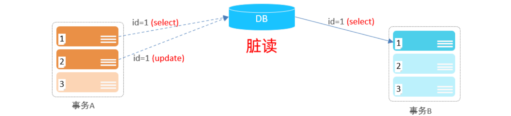
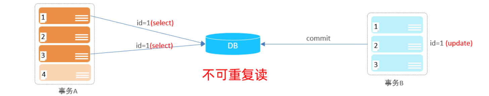
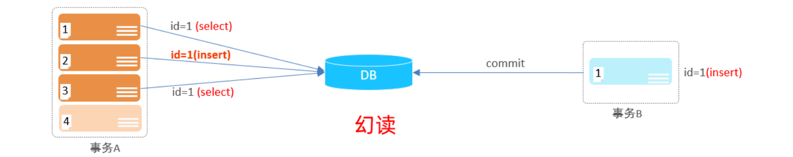

# 事务隔离级别

## 1.隔离级别介绍

1. 事务隔离级别定义了一个事务在执行过程中对其他事务的可见性和干扰程度。SQL 标准定义了四种主要的事务隔离级别。从低到高分别是：

   - **读未提交 (Read Uncommitted)**：允许一个事务读取另一个未提交事务的修改。可能导致“脏读”，即读取到不一致的数据。
     - 问题：脏读、不可重复读、幻读都可能发生。
     - 实际应用：由于性能问题和潜在的数据一致性问题，这种隔离级别在实际应用中很少使用。
   - **读已提交 (Read Committed)**：一个事务只能读取已提交事务的数据。可以避免脏读，但可能出现“不可重复读”，即在同一事务中多次读取同一数据可能得到不同的结果。
     - 问题：虽然避免了脏读，但同一个事务内多次读取同一数据集合时，由于其他事务的提交，导致读取的数据可能不一致，即不可重复读。
   - **可重复读 (Repeatable Read)**：保证在同一个事务中多次读取同样记录的结果是一致的。这是MySQL的默认隔离级别。
     - 问题：解决了脏读和不可重复读的问题，但可能会遇到幻读。
     - 实现机制：MySQL的InnoDB存储引擎通过多版本并发控制（MVCC）和Next-Key Locks机制来实现可重复读，避免了幻读的发生（在大多数情况下）。
   - **串行化 (Serializable)**：最高的隔离级别，它通过强制事务串行执行，避免了脏读、不可重复读和幻读。
     - 问题：性能开销较大，因为它要求事务按顺序执行，可能导致较低的并发性。

2. MySQL的四种隔离级别从上到下，隔离强度逐渐增强，但执行效率逐渐降低。因为隔离级别越低，事务请求的锁越少，所以大部分数据库系统的隔离级别都是READ-COMMITTED(读取提交内容):，但是你要知道的是InnoDB 存储引擎默认使用 REPEATABLE-READ（可重读）并不会有任何性能损失。在实际应用中，需要根据具体场景和需求选择合适的隔离级别，以平衡数据一致性和系统性能。

   ### 1.1.设置事务隔离级别

   >:bell:注意：事务隔离级别越高，数据越安全，但是性能越低。

   ~~~sql
   # 设置事务隔离级别
   mysql> set global transaction_isolation='READ-UNCOMMITTED';
   mysql> set global transaction_isolation='READ-COMMITTED';
   mysql> set global transaction_isolation='REPEATABLE-READ';
   
   # 查看事务隔离级别
   mysql> select @@transaction_isolation;
   +---------------------------------+
   | @@transaction_isolation |
   +---------------------------------+
   | READ-UNCOMMITTED         |
   +---------------------------------+
   
   mysql> select @@transaction_isolation;
   +---------------------------------+
   | @@transaction_isolation  |
   +---------------------------------+
   | READ-COMMITTED               |
   +---------------------------------+
   
   mysql> select @@transaction_isolation;
   +---------------------------------+
   | @@transaction_isolation |
   +---------------------------------+
   | REPEATABLE-READ             |
   +---------------------------------+
   
   # 临时关闭自动提交功能：
   mysql> set global autocommit=0;
   mysql> select @@autocommit;
   +---------------------+
   | @@autocommit |
   +---------------------+
   |                          0 |
   +---------------------+
   ~~~

## 2.并发事务问题

>并发事务问题是指在数据库系统中，多个事务同时执行时可能导致的数据不一致性和完整性问题。脏读（Dirty Read）、幻读（Phantom Read）和不可重复读（Non-repeatable Read）是并发事务中可能遇到的数据一致性问题。

### 2.1.脏读 (Dirty Read)

1. **概念**：一个事务读取到了另一个事务未提交的数据。当一个事务正在对某条数据进行修改，并且这个修改还没有提交到数据库中时，另一个事务读取了这条未提交的数据，并基于这个“脏”数据做了进一步的处理。如果第一个事务因为某种原因回滚了，那么第二个事务读取的数据就是无效的，因为它基于了一个从未真正存在过的数据版本。

>比如B读取到了A未提交的数据。

### 2.1.不可重复读 (Non-repeatable Read)

1. 概念：更高级别的数据不一致问题，它发生在当事务重新读取某个范围的记录时，其他事务插入了符合查询条件的新记录，导致两次查询的结果不一致。幻读和不可重复读的区别在于，不可重复读是读取到了已存在的数据发生了变更，而幻读是读取到了新插入的数据。幻读问题通常发生在范围查询或聚合查询中，它破坏了事务的隔离性，使得事务在多次执行相同的查询时可能会得到不同的结果集。一个事务先后读取同一条记录，但两次读取的数据不同，称之为不可重复读。

>事务A两次读取同一条记录，但是读取到的数据却是不一样的。

### 2.3.幻读 (Phantom Read)

1. 概念：在一个事务内，多次读取同一数据集合时，由于其他事务的并发更新，导致每次读取的数据可能不一致。这通常发生在事务执行期间，其他事务对数据进行了修改并提交，从而使得第一个事务在后续读取时获得了不同的数据。不可重复读破坏了事务的隔离性，使得事务内的数据读取变得不可靠。一个事务按照条件查询数据时，没有对应的数据行，但是在插入数据时，又发现这行数据已经存在，好像出现了 "幻影"。

| **隔离级别**                 | **脏读** | **不可重复读** | **幻读**                                   |
| ---------------------------- | -------- | -------------- | ------------------------------------------ |
| 读未提交（Read Uncommitted） | 允许     | 允许           | 允许                                       |
| 读已提交（Read Committed）   | 禁止     | 允许           | 允许                                       |
| 可重复读（Repeatable Read）  | 禁止     | 禁止           | 大部分情况禁止（通过MVCC和Next-Key Locks） |
| 可串行化（Serializable）     | 禁止     | 禁止           | 禁止                                       |

## 3.隔离级别测试

1. 创建隔离级别测试数据表：

~~~sql
mysql> use test_db;

mysql> create table t1 (
    id int not null primary key auto_increment,
    a int not null,
    b varchar(20) not null,
    c varchar(20) not null
) charset=utf8mb4 engine=innodb;

mysql> begin;

mysql> insert into t1(a,b,c)
values
(5,'a','aa'),
(7,'c','ab'),
(10,'d','ae'),
(13,'g','ag'),
(14,'h','at'),
(16,'i','au'),
(20,'j','av'),
(22,'k','aw'),
(25,'l','ax'),
(27,'o','ay'),
(31,'p','az'),
(50,'x','aze'),
(60,'y','azb');

mysql> commit;
~~~

### 3.1.隔离级别RU（脏读）

>脏读主要表示在一个事务窗口中，没有数据修改提交操作前，另一个事务就可以看到内存中数据页的修改；简单理解：在一个事务窗口中，可以读取到别人没有提交的数据信息。

~~~sql
-- 1.查看当前事务隔离级别
mysql> select @@transaction_isolation;
+-------------------------+
| @@transaction_isolation |
+-------------------------+
| REPEATABLE-READ         |
+-------------------------+

-- 2.设置事务隔离级别。
mysql> set global transaction_isolation='READ-COMMITTED';
Query OK, 0 rows affected (0.00 sec)

-- 3.重新登录mysql。查看事务隔离级别。
mysql> select @@transaction_isolation;
+-------------------------+
| @@transaction_isolation |
+-------------------------+
| READ-COMMITTED          |
+-------------------------+

-- 3.开启两个SQL会话窗口，即不同的事务查看的数据是否一致的。

-- 数据库A会话窗口操作
mysql> begin;
mysql> update t1 set a=10 where id=1;
-- 只是在内存层面进行数据页中数据修改
mysql> rollback;
-- 进行事务回滚操作

# 数据库B会话窗口操作
mysql> begin;
mysql> select * from t1 where id=1;
+----+----+---+----+
| id   | a   | b  | c   |
+----+----+---+----+
|  1   | 10 | a  | aa |
+----+----+---+----+
1 row in set (0.01 sec)
-- 在A会话窗口没提交的事务修改，被B会话窗口查询到了
mysql> select * from t1 where id=1;
+----+----+---+----+
| id   | a   | b  | c   |
+----+----+---+----+
|  1   | 5   | a  | aa |
+----+----+---+----+
1 row in set (0.01 sec)
-- 在A会话窗口进行回滚后，在B窗口查询的数据又恢复了
~~~

### 3.2.隔离级别RU（不可重复读）

>不可重复读表示在一个事务中，利用相同的语句多次查询，获取的数据信息是不同的；

~~~sql
# 数据库B会话窗口操作
mysql> begin;
mysql> select * from t1 where id=1;
+----+----+---+----+
| id   | a   | b  | c   |
+----+----+---+----+
|  1   | 10 | a  | aa |
+----+----+---+----+
1 row in set (0.01 sec)
-- 在B会话事务窗口进行数据第一次查询看到数据信息：a=10
mysql> select * from t1 where id=1;
+----+----+---+----+
| id   | a   | b  | c   |
+----+----+---+----+
|  1   | 5   | a  | aa |
+----+----+---+----+
1 row in set (0.01 sec)
-- 在B会话事务窗口进行数据第二次查询看到数据信息：a=5
~~~

### 3.3.隔离级别RC（不可重复读）

~~~sql
# 设置事务隔离级别
mysql> set global transaction_isolation='READ-COMMITTED';
mysql> select @@transaction_isolation;
+---------------------------------+
| @@transaction_isolation |
+---------------------------------+
| READ-COMMITTED              |
+---------------------------------+
mysql> set global autocommit=0;
mysql> select @@autocommit;
-- 重新开启两个SQL会话窗口

# 数据库A会话窗口操作
mysql> use test_db;
mysql> begin;
mysql> select * from t1 where id=1;
+----+---+---+----+
| id   | a  | b  | c  |
+----+---+---+----+
|  1   | 5  | a  | aa |
+----+---+---+----+
1 row in set (0.00 sec)
-- A窗口事务查询信息 = B窗口事务查询信息
mysql> update t1 set a=10 where id=1;
-- A窗口事务进行修改
mysql> commit;
-- A窗口事务进行提交

# 数据库B会话窗口操作
mysql> use test_db;
mysql> begin;
mysql> select * from t1 where id=1;
+----+---+---+----+
| id   | a  | b  | c  |
+----+---+---+----+
|  1   | 5  | a  | aa |
+----+---+---+----+
1 row in set (0.00 sec)
-- A窗口事务查询信息 = B窗口事务查询信息
mysql> select * from t1 where id=1;
+----+---+---+----+
| id   | a  | b  | c  |
+----+---+---+----+
|  1   | 5  | a  | aa |
+----+---+---+----+
1 row in set (0.00 sec)
-- B窗口事务查询信息，不能看到A窗口事务未提交的数据变化，避免了脏数据问题；
mysql> select * from t1 where id=1;
+----+---+---+----+
| id   | a  | b  | c  |
+----+---+---+----+
|  1   | 10 | a  | aa |
+----+---+---+----+
1 row in set (0.00 sec)
-- A窗口事务提交之后，B窗口事务查询信息和之前不同了
~~~

### 3.4.隔离级别RR（不可重复读）

~~~sql
# 设置事务隔离级别
mysql> set global transaction_isolation='REPEATABLE-READ';
mysql> select @@transaction_isolation;
+---------------------------------+
| @@transaction_isolation |
+---------------------------------+
| REPEATABLE-READ              |
+---------------------------------+
mysql> set global autocommit=0;
mysql> select @@autocommit;
-- 重新开启两个SQL会话窗口

# 数据库A会话窗口操作
mysql> use test_db;
mysql> begin;
mysql> select * from t1;
-- 确认初始数据信息
mysql> update t1 set a=10 where id=1;
-- A窗口事务进行修改
mysql> commit;
-- A窗口事务进行提交

# 数据库B会话窗口操作
mysql> use test_db;
mysql> begin;
mysql> select * from t1;
-- 确认初始数据信息
mysql> select * from t1 where id=1;
+----+---+---+----+
| id   | a  | b  | c  |
+----+---+---+----+
|  1   | 5  | a  | aa |
+----+---+---+----+
1 row in set (0.00 sec)
-- B窗口事务查询信息，不能看到A窗口事务未提交的数据变化，避免了脏数据问题；
mysql> select * from t1 where id=1;
+----+---+---+----+
| id   | a  | b  | c  |
+----+---+---+----+
|  1   | 5  | a  | aa |
+----+---+---+----+
1 row in set (0.00 sec)
-- A窗口事务提交之后，B窗口事务查询信息和之前是相同的；
-- 在RR级别状态下，同一窗口的事务生命周期下，每次读取相同数据信息是一样，避免了不可重复读问题
mysql> commit;
mysql> select * from t1 where id=1;
-- 在RR级别状态下，同一窗口的事务生命周期结束后，看到的数据信息就是修改的了
~~~

### 3.5.隔离级别RC（幻读）

~~~sql
# 设置事务隔离级别
mysql> set global transaction_isolation='READ-COMMITTED';
mysql> select @@transaction_isolation;
+---------------------------------+
| @@transaction_isolation |
+---------------------------------+
| READ-COMMITTED              |
+---------------------------------+
mysql> set global autocommit=0;
mysql> select @@autocommit;
-- 重新开启两个SQL会话窗口

# 数据库A会话窗口操作（重新进入）
mysql> use test_db;
mysql> select * from t1;
+----+----+---+-----+
| id | a  | b | c   |
+----+----+---+-----+
|  1 | 10 | a | aa  |
|  2 |  7 | c | ab  |
|  3 | 10 | d | ae  |
|  4 | 13 | g | ag  |
|  5 | 14 | h | at  |
|  6 | 16 | i | au  |
|  7 | 20 | j | av  |
|  8 | 22 | k | aw  |
|  9 | 25 | l | ax  |
| 10 | 27 | o | ay  |
| 11 | 31 | p | az  |
| 12 | 50 | x | aze |
| 13 | 60 | y | azb |
+----+----+---+-----+
13 rows in set (0.00 sec)
-- 查看获取A窗口表中数据
mysql> alter table t1 add index idx(a);
-- 在A窗口中，添加t1表的a列为索引信息
mysql> begin;
-- 在A窗口和B窗口中，同时做开始事务操作；
mysql> update t1 set a=20 where a<20;
-- 在A窗口中，将a<20的信息均调整为20
mysql> commit;
-- 在A窗口中，进行事务提交操作，是在B窗口事务没有提交前
mysql> mysql> select * from t1;
-- 在A窗口中，查看数据信息，希望看到的a是没有小于20的，但是结果看到了a存在等于10的（即出现了幻读）

# 数据库B会话窗口操作（重新进入）
mysql> use test_db;
mysql> select * from t1;
+----+----+---+-----+
| id | a  | b | c   |
+----+----+---+-----+
|  1 | 10 | a | aa  |
|  2 |  7 | c | ab  |
|  3 | 10 | d | ae  |
|  4 | 13 | g | ag  |
|  5 | 14 | h | at  |
|  6 | 16 | i | au  |
|  7 | 20 | j | av  |
|  8 | 22 | k | aw  |
|  9 | 25 | l | ax  |
| 10 | 27 | o | ay  |
| 11 | 31 | p | az  |
| 12 | 50 | x | aze |
| 13 | 60 | y | azb |
+----+----+---+-----+
13 rows in set (0.00 sec)
-- 查看获取B窗口表中数据
mysql> begin;
mysql> insert into t1(a,b,c) values(10,'A','B')
-- 在B窗口中，插入一条新的数据信息 a=10 
mysql> commit;
-- 在B窗口中，进行事务提交操作
~~~

### 3.6.隔离级别RR（幻读）

~~~sql
# 设置事务隔离级别
mysql> set global transaction_isolation='REPEATABLE-READ';
mysql> select @@transaction_isolation;
+---------------------------------+
| @@transaction_isolation |
+---------------------------------+
| REPEATABLE-READ              |
+---------------------------------+
mysql> set global autocommit=0;
mysql> select @@autocommit;
-- 重新开启两个SQL会话窗口

# 数据库A会话窗口操作
mysql> use test_db;
mysql> select * from t1;
-- 查看获取A窗口表中数据
mysql> alter table t1 add index idx(a);
-- 在A窗口中，添加t1表的a列为索引信息
mysql> begin;
mysql> update t1 set a=20 where a>20;
-- 在A窗口中，将a>20的信息均调整为20

# 数据库B会话窗口操作
mysql> use test_db;
mysql> select * from t1;
-- 查看获取B窗口表中数据
mysql> begin;
mysql> insert into t1(a,b,c) values(30,'sss','bbb');
-- 在B窗口中，插入一条新的数据信息 a=30，但是语句执行时会被阻塞，没有反应；
mysql> show processlist;
-- 在C窗口中，查看数据库连接会话信息，insert语句在执行，等待语句超时（默认超时时间是50s）
-- 因为此时在RR机制下，创建了行级锁(阻塞修改)+间隙锁(阻塞区域间信息插入)=next lock
-- 区域间隙锁 < 左闭右开(可用临界值)  ;  区域间隙锁 > 左开右闭（不可用临界值）
~~~

## 4.两个事务的行为

>假设数据表 T 中只有一列，其中一行的值为 1，下面是按照时间顺序执行两个事务的行为。

~~~sql
mysql> create table T(c int) engine=InnoDB;
mysql> insert into T(c) values(1);
~~~

| 事务行为顺序 | 事务A                 | 事务B       |
| ------------ | --------------------- | ----------- |
| 01           | 启动事务；查询得到值1 | 启动事务    |
| 02           |                       | 查询得到值1 |
| 03           |                       | 将1改为2    |
| 04           | 查询得到值v1          |             |
| 05           |                       | 提交事务B   |
| 06           | 查询得到值v2          |             |
| 07           | 提交事务A             |             |
| 08           | 查询得到值v3          |             |

在不同的隔离级别下，事务 A 会有哪些不同的返回结果，也就是图里面 V1、V2、V3 的返回值分别是什么。

- **若隔离级别是“读未提交”：**

则 V1 的值就是 2，事务 B 虽然还没有提交，但是结果已经被 A 看到了。因此，V2、V3 也都是 2。

- **若隔离级别是“读提交”：**

则 V1 是 1，V2 的值是 2，事务 B 的更新在提交后才能被 A 看到。所以， V3 的值也是 2。

- **若隔离级别是“可重复读”：**

则 V1、V2 是 1，V3 是 2，之所以 V2 还是 1，遵循的就是这个要求：事务在执行期间看到的数据前后必须是一致的。

- **若隔离级别是“串行化”：**

则在事务 B 执行“将 1 改成 2”的时候，会被锁住。直到事务 A 提交后，事务 B 才可以继续执行。

所以从 A 的角度看， V1、V2 值是 1，V3 的值是 2。

