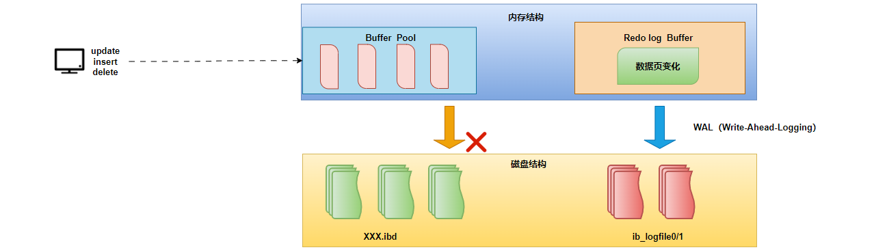

# 事务工作原理

1. 为了确保事务的 ACID 特性，MySQL 使用了一系列机制，包括 MVCC（多版本并发控制）和锁。

2. **redo log**：重做日志，记录的是事务提交时数据页的物理修改，是用来实现事务的持久性。该日志文件由两部分组成:重做日志缓冲(redolog buffer)以及重做日志文件(redolog file),前者是在内存中，后者在磁盘中。当事务提交之后会把所有修改信息都存到该日志文件中,用于在刷新脏页到磁盘,发生错误时,进行数据恢复使用。
   - **redo log file**：当出现异常情况，内存中数据直接写入磁盘失败时，可以通过重启数据库服务，读取此文件修复数据信息；文件存储表项为：ib_logfile0~N    默认48M，轮询使用。
   - **redo log buffer**：表示重做日志生成缓冲区，相当于redo log的内存区域。redo log文件与redo log buffer是有IO关系的；
     - 事务修改提交后：redo log buffer -> redo log，表示写入数据到redo log；
     - 事务操作恢复时：redo log -> redo log buffer，表示读取数据从redo log；

3. **undo log**：回滚日志，用于记录数据被修改前的信息，作用包含两个:提供回滚 和 MVCC(多版本并发控制)。undolog和redolog记录物理日志不一样，它是逻辑日志。可以认为当delete一条记录时，undolog中会记录一条对应的insert记录，反之亦然，当update一条记录时，它记录一条对应相反的update记录。当执行rollback时，就可以从undolog中的逻辑记录读取到相应的内容并进行回滚。
   - undolog销毁:undolog在事务执行时产生，事务提交时，并不会立即删除undolog，因为这些日志可能还用于MVCC。
   - undolog存储:undol0g采用段的方式进行管理和记录，存放在前面介绍的rolbacksegment 回滚段中，内部包含1024个undolog  segment。
4. **tablespace file**：表示存储表数据行和索引等信息的文件，含有表空间所有数据文件；ibd。
5. **Innodb buffer pool**：表示数据缓冲区，主要用于缓冲事务要处理的数据和索引信息，tablespace文件与buffer pool是有IO关系的。
6. **LSN**：表示日志序列号，在buffer pool中有数据页信息的变化就会记录到redo log buffer中，主要记录变化了多少字节量；利用LSN记录相应数据页的变化量(LSN+变化字节量)，也可以理解为记录的是日志量的变化；MySQL每次数据库启动，都会比较磁盘数据页和redolog的LSN，必须要求两者一致，数据库才能正常启动。
7. **WAL（Write Ahead Log）**：是一种日志记录机制，表示redo日志生成记录优先于数据页写入到磁盘的过程，并且是支持预写入机制（group commit）的

## 1.MVCC-基本概念

1. 当前读：读取的是记录的最新版本，读取时还要保证其他并发事务不能修改当前记录，会对读取的记录进行加锁。对于我们日常的操作，如: select .. lock in share mode(共享锁),select ... for update、update、insert、delete(排他锁)都是一种当前读。
2. 快照读：简单的select(不加锁)就是快照读，快照读，读取的是记录数据的可见版本，有可能是历史数据，不加锁，是非阻塞读。
   - Read committed:每次select，都生成一个快照读。
   - Repeatable Read:开启事务后第一个select语句才是快照读的地方。
   - Serializable:快照读会退化为当前读。
3. MVCC：全称 Multi-Version Concurrency Control，多版本并发控制。指维护一个数据的多个版本，使得读写操作没有冲突，快照读为MVSOL实现MVCC提供了一个非阻塞读功能。MVCC的具体实现，还需要依赖于数据库记录中的三个隐式字段、undo log日志、readView。

### 1.1.MVCC实现原理

#### 1.1.1.三个隐藏字段

1. 在数据库的 MVCC 机制中，通常会有三个隐藏字段，用于管理事务的版本和状态。这些字段帮助数据库系统跟踪每个数据行的版本和相关的事务信息。
   - **DB TRX_ID**：用于标识对某一行数据进行修改的事务，记录插入这条记录或最后一次修改该记录的事务ID。执行事务隔离和版本控制时，帮助数据库判断数据的可见性。在回滚操作中，可以用于识别需要撤销的事务。
   - **DB_ROLL_PTR**：是回滚指针，指向这条记录的上一个版本，用于配合undolog，指向上一个版本。在发生回滚时，数据库系统可以使用这个指针找到相应的 undo 日志，从而恢复数据到修改之前的状态。帮助实现事务的原子性和一致性，确保在事务失败时能够撤销对数据的修改。
   - **DB_ROW_ID**：隐藏主键，如果表结构没有指定主键，将会生成该隐藏字段。提供每行数据的唯一性，使得数据库能够高效地访问和管理数据。
   - `DB_TRX_ID` 记录事务的身份，`DB_ROLL_PTR` 负责回滚操作的指向，`DB_ROW_ID` 则保证了每行数据的唯一性。避免了数据冲突和不一致问题。

#### 1.1.2.undo log日志

1. 在 MVCC（多版本并发控制）中，**undo log** 日志机制，用于支持事务的回滚和数据的版本管理。它记录了对数据的修改操作，以便在需要时撤销这些操作，确保数据的一致性和事务的原子性。
   - **记录修改**：当事务对数据进行修改时，系统不仅会记录新的数据版本，还会生成相应的 undo log。这个日志记录了修改前的状态，以便在事务回滚时使用。比如：在insert、update、delete的时候产生的便于数据回滚的日志。
   - **回滚操作**：如果事务执行过程中发生错误，或者用户主动选择回滚，数据库系统会根据 undo log 恢复数据到修改之前的状态。这一过程是通过应用 undo log 中记录的操作来实现的。
   - **日志格式**：
     - 修改的数据行的标识（如 `DB_ROW_ID`）。
     - 事务 ID（如 `DB_TRX_ID`），用于标识执行修改的事务。
     - 修改前的值，允许系统在回滚时恢复到旧值。
     - 操作类型（如插入、更新、删除），指明该操作的性质。
   - 在 MVCC 中，每次数据修改都会生成新的数据版本，而旧版本会通过 undo log 记录。这样，其他事务在执行时可以访问到旧版本的数据，确保了事务的隔离性。
2. **undo log版本链**：在数据库的 MVCC（多版本并发控制）机制中，**undo log 版本链** 是一种用于管理数据版本的结构，允许系统在事务执行时跟踪和恢复数据的历史状态。每当对数据进行修改时，都会生成新的数据版本，并通过 undo log 记录旧版本的信息，从而形成一条版本链。

