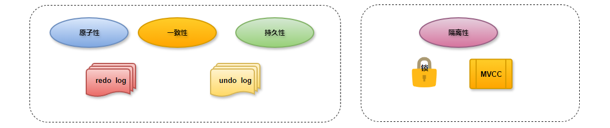

# 事务工作原理

1. 为了确保事务的 ACID 特性，MySQL 使用了一系列机制，包括 MVCC（多版本并发控制）和锁。

2. **redo log**：重做日志，记录的是事务提交时数据页的物理修改，是用来实现事务的持久性。该日志文件由两部分组成:重做日志缓冲(redolog buffer)以及重做日志文件(redolog file),前者是在内存中，后者在磁盘中。当事务提交之后会把所有修改信息都存到该日志文件中,用于在刷新脏页到磁盘,发生错误时,进行数据恢复使用。
   - **redo log file**：当出现异常情况，内存中数据直接写入磁盘失败时，可以通过重启数据库服务，读取此文件修复数据信息；文件存储表项为：ib_logfile0~N    默认48M，轮询使用。
   - **redo log buffer**：表示重做日志生成缓冲区，相当于redo log的内存区域。redo log文件与redo log buffer是有IO关系的；
     - 事务修改提交后：redo log buffer -> redo log，表示写入数据到redo log；
     - 事务操作恢复时：redo log -> redo log buffer，表示读取数据从redo log；

3. **undo log**：回滚日志，用于记录数据被修改前的信息，作用包含两个:提供回滚 和 MVCC(多版本并发控制)。undolog和redolog记录物理日志不一样，它是逻辑日志。可以认为当delete一条记录时，undolog中会记录一条对应的insert记录，反之亦然，当update一条记录时，它记录一条对应相反的update记录。当执行rollback时，就可以从undolog中的逻辑记录读取到相应的内容并进行回滚。
   - undolog销毁:undolog在事务执行时产生，事务提交时，并不会立即删除undolog，因为这些日志可能还用于MVCC。
   - undolog存储:undol0g采用段的方式进行管理和记录，存放在前面介绍的rolbacksegment 回滚段中，内部包含1024个undolog  segment。
4. **tablespace file**：表示存储表数据行和索引等信息的文件，含有表空间所有数据文件；ibd。
5. **Innodb buffer pool**：表示数据缓冲区，主要用于缓冲事务要处理的数据和索引信息，tablespace文件与buffer pool是有IO关系的。
6. **LSN**：表示日志序列号，在buffer pool中有数据页信息的变化就会记录到redo log buffer中，主要记录变化了多少字节量；利用LSN记录相应数据页的变化量(LSN+变化字节量)，也可以理解为记录的是日志量的变化；MySQL每次数据库启动，都会比较磁盘数据页和redolog的LSN，必须要求两者一致，数据库才能正常启动。
7. **WAL（Write Ahead Log）**：是一种日志记录机制，表示redo日志生成记录优先于数据页写入到磁盘的过程，并且是支持预写入机制（group commit）的

