# 锁

## 1.概念

>锁是计算机协调多个进程或线程并发访问某一资源的机制。在数据库中，除传统的计算资源（CPU、RAM、I/O）的争用以外，数据也是一种供许多用户共享的资源。如何保证数据并发访问的一致性、有效性是所有数据库必须解决的一个问题，锁冲突也是影响数据库并发访问性能的一个重要因素。
>
>锁是计算机在执行多线程或线程时用于并发访问同一共享资源时的同步机制，MySQL中的锁是在服务器层或者存储引擎层实现的，保证了数据访问的一致性与有效性。

1. MySQL中的锁，按照锁的粒度分，分为以下三类：
   - 全局锁：对整个数据库实例加锁。
   - 表级锁：当前操作的整张表加锁，最常使用的 MyISAM 与 InnoDB 都支持表级锁定。
   - 行级锁：行级锁是粒度最低的锁，发生锁冲突的概率也最低、并发度最高。但是加锁慢、开销大，容易发生死锁现象。
2. InnoDB 存储引擎同时支持行级锁（row-level locking）和表级锁（table-level locking），默认情况下采用行级锁。
3. 表级锁适用于并发较低、以查询为主的应用，例如中小型的网站；MyISAM 和 MEMORY 存储引擎采用表级锁。
4. 行级锁适用于按索引条件高并发更新少量不同数据，同时又有并发查询的应用，例如 OLTP 系统；InnoDB 和 NDB 存储引擎实现了行级锁。

## 2.全局锁

1. 概念：
   - 全局锁是**对整个数据库实例加锁**，**加锁后整个实例就处于只读状态**，后续DML的写语句，DDL语句，已经更新操作的事务提交语句都会被阻塞。其典型的使用场景是做**全库的逻辑备份**，对所有的表进行锁定，从而获取一致性视图，保证数据的完整性。
2. 特点：
   - **锁定范围**：全局锁会锁定整个数据库实例，其他任何事务都无法对数据库执行读写操作，直到锁被释放。
   - **阻塞其他操作**：在全局锁定期间，所有对数据库的操作（包括读和写）都会被阻塞，从而保证在执行关键任务时数据的一致性。
   - **性能影响**：由于全局锁会阻塞所有操作，因此在使用时需要谨慎，以避免对系统性能造成严重影响。
3. 注意事项：
   - 使用全局锁时要小心，因为它会影响到数据库的可用性。尽量缩小锁的持有时间，以减少对其他操作的影响。
   - 在高并发环境下，使用全局锁可能会导致严重的性能瓶颈，建议根据实际情况评估其必要性。

~~~sql
-- 1、加全局锁
mysql> flush tables with read lock ;

-- 2、释放锁
mysql> unlock tables ;
~~~

## 3.表级锁

1. 概念：
   - 表级锁（Table Lock）是MySQL中一种锁定机制，用于控制对整个表的访问。表级锁主要用于在执行特定操作时保证数据的一致性和完整性。
2. 分类：
   - **表锁**：用于控制对整个表的访问。表锁可以分为两种主要类型
     - **表共享读锁（Read Lock）**：允许多个事务同时读取表的数据，但不允许任何事务对表进行写入。获得共享锁的事务可以并发读取，但无法进行更新操作。
     - **表独占写锁（Write Lock）**：只允许一个事务对表进行写入，其他事务既不能读取也不能写入。获取独占锁的事务会阻塞所有其他事务的读写操作。
   - **意向锁（Intention Lock）**：用于支持多粒度锁（如行级锁和表级锁）的一种机制，主要用于解决锁的兼容性问题，确保在不同级别的锁之间能够正确协作。
     - **意向共享锁（IS）**：表示一个事务希望对某些行加共享锁，但希望在表级别上获得共享锁。允许其他事务在同一表上也加意向共享锁，但不允许加意向排他锁。
     - **意向排他锁（IX）**：表示一个事务希望对某些行加排他锁，同时希望在表级别上获得排他锁。允许其他事务加意向共享锁或意向排他锁，但不允许其他事务对该表加排他锁。
   - **元数据锁（meta data lock, MDL）**：用于保护数据库对象（如表和数据库）的结构性操作的一种锁机制。它确保在对表结构进行修改时，其他事务无法对该表进行读写操作，主要作用是维护表元数据的数据一致性，在表上有活动事务的时候，不可以对元数据进行写入操作。为了避免DML与DDL冲突，保证读写的正确性。
     - 当对表做增删改查操作时加元数据读锁。允许多个事务同时读取表的元数据，但在有事务持有读锁时，不允许有事务获取写锁。
     - 当对表做结构变更操作的时候加元数据写锁。当一个事务对表进行修改时，会获取写锁，阻止其他事务对该表的读取和写入。
     - 在执行DDL语句时，MySQL会自动获取元数据锁，确保在表结构被修改的期间，其他事务不会对该表进行读取或写入。

### 3.1.表锁

>**表锁**：用于控制对整个表的访问。表锁可以分为两种主要类型
>
>1. **表共享读锁（Read Lock）**：允许多个事务同时读取表的数据，但不允许任何事务对表进行写入。获得共享锁的事务可以并发读取，但无法进行更新操作。
>2. **表独占写锁（Write Lock）**：只允许一个事务对表进行写入，其他事务既不能读取也不能写入。获取独占锁的事务会阻塞所有其他事务的读写操作。

1. 语法：

~~~sql
-- 1、表共享读锁（Read Lock）
## 加锁
LOCK TABLES table_name READ;

## 释放锁
UNLOCK TABLES;

-- 2、表独占写锁（Write Lock）
## 加锁
LOCK TABLES table_name WRITE;

## 释放锁
UNLOCK TABLES;
~~~

2. 测试读锁：左侧为客户端一，对指定表加了读锁，不会影响右侧客户端二的读，但是会阻塞右侧客户端的写。

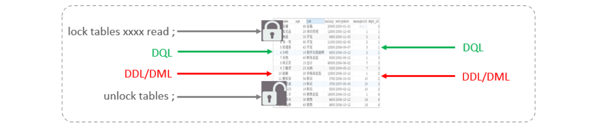

~~~sql
-- 1、客户端一
mysql> LOCK TABLES users READ;          
Query OK, 0 rows affected (0.00 sec)

mysql> select * from users;
+----+-------+---------------------+
| id | name  | email               |
+----+-------+---------------------+
|  1 | Alice | alice@example.com   |
|  2 | Bob   | bob@example.com     |
|  3 | Mmban | charlie@example.com |
+----+-------+---------------------+
3 rows in set (0.00 sec)

mysql> update users set name='GGbo' where id=3;              
ERROR 1099 (HY000): Table 'users' was locked with a READ lock and can t be updated
mysql> UNLOCK TABLES;
Query OK, 0 rows affected (0.00 sec)

mysql> select * from users;
+----+-------+---------------------+
| id | name  | email               |
+----+-------+---------------------+
|  1 | Alice | alice@example.com   |
|  2 | Bob   | bob@example.com     |
|  3 | GGbo  | charlie@example.com |
+----+-------+---------------------+
3 rows in set (0.00 sec)

-- 2、客户端二
mysql> select * from users;
+----+-------+---------------------+
| id | name  | email               |
+----+-------+---------------------+
|  1 | Alice | alice@example.com   |
|  2 | Bob   | bob@example.com     |
|  3 | Mmban | charlie@example.com |
+----+-------+---------------------+
3 rows in set (0.00 sec)

mysql> select * from users;
+----+-------+---------------------+
| id | name  | email               |
+----+-------+---------------------+
|  1 | Alice | alice@example.com   |
|  2 | Bob   | bob@example.com     |
|  3 | Mmban | charlie@example.com |
+----+-------+---------------------+
3 rows in set (0.00 sec)

mysql> update users set name='GGbo' where id=3;
Query OK, 1 row affected (4.63 sec)
Rows matched: 1  Changed: 1  Warnings: 0
~~~

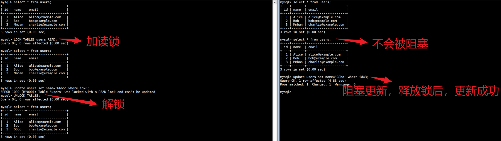

3. 测试写锁：左侧为客户端一，对指定表加了写锁，会阻塞右侧客户端的读和写。

~~~sql
-- 1、客户端一
mysql> LOCK TABLES users WRITE;          
Query OK, 0 rows affected (0.00 sec)

mysql> select * from users;
+----+-------+---------------------+
| id | name  | email               |
+----+-------+---------------------+
|  1 | Alice | alice@example.com   |
|  2 | Bob   | bob@example.com     |
|  3 | GGbo  | charlie@example.com |
+----+-------+---------------------+
3 rows in set (0.00 sec)

mysql> update users set name='Mmban' where id=3;    
Query OK, 1 row affected (0.00 sec)
Rows matched: 1  Changed: 1  Warnings: 0

mysql> UNLOCK TABLES;
Query OK, 0 rows affected (0.00 sec)

mysql> select * from users;
+----+-------+---------------------+
| id | name  | email               |
+----+-------+---------------------+
|  1 | Alice | alice@example.com   |
|  2 | Bob   | bob@example.com     |
|  3 | Job   | charlie@example.com |
+----+-------+---------------------+
3 rows in set (0.00 sec)

-- 2、客户端二
mysql> select * from users;
^C^C -- query aborted
ERROR 1317 (70100): Query execution was interrupted
mysql> update users set name='Job' where id=3;        
Query OK, 1 row affected (8.27 sec)
Rows matched: 1  Changed: 1  Warnings: 0

mysql> select * from users;
+----+-------+---------------------+
| id | name  | email               |
+----+-------+---------------------+
|  1 | Alice | alice@example.com   |
|  2 | Bob   | bob@example.com     |
|  3 | Job   | charlie@example.com |
+----+-------+---------------------+
3 rows in set (0.00 sec)
~~~

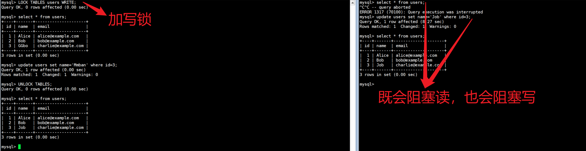

4. 结论: 读锁不会阻塞其他客户端的读，但是会阻塞写。写锁既会阻塞其他客户端的读，又会阻塞其他客户端的写。

### 3.2.元数据锁

>MDL加锁过程是系统自动控制，无需显式使用，在访问一张表的时候会自动加上。MDL锁主要作用是维护表元数据的数据一致性，在表上有活动事务的时候，不可以对元数据进行写入操作。为了避免DML与DDL冲突，保证读写的正确性。
>
>meta data lock , 元数据锁，简写MDL。
>
>这里的元数据可以简单理解为就是一张表的表结构。 也就是说，某一张表涉及到未提交的事务时，是不能够修改这张表的表结构的。
>
>在MySQL5.5中引入了MDL，**当对一张表进行增删改查的时候，加MDL读锁(共享)**；**当对表结构进行变更操作的时候，加MDL写锁(排他)**。

1. 常见的SQL操作时，所添加的元数据锁：

| 对应SQL                                         | 锁类型                                  | 说明                                             |
| ----------------------------------------------- | --------------------------------------- | ------------------------------------------------ |
| lock tables xxx read /write                     | SHARED_READ_ONLY / SHARED_NO_READ_WRITE |                                                  |
| select 、select ...lock in share mode           | SHARED_READ                             | 与SHARED_READ、SHARED_WRITE兼容，与EXCLUSIVE互斥 |
| insert 、update、delete、select ... for、update | SHARED_WRITE                            | 与SHARED_READ、SHARED_WRITE兼容，与EXCLUSIVE互斥 |
| alter table ...                                 | EXCLUSIVE                               | 与其他的MDL都互斥                                |

2. 测试：当执行SELECT、INSERT、UPDATE、DELETE等语句时，添加的是元数据共享锁（SHARED_READ / SHARED_WRITE），之间是兼容的。

~~~sql
-- 1、客户端一
mysql> begin;
Query OK, 0 rows affected (0.00 sec)

mysql> select * from users;
+----+-------+---------------------+
| id | name  | email               |
+----+-------+---------------------+
|  1 | Alice | alice@example.com   |
|  2 | Bob   | bob@example.com     |
|  3 | Job   | charlie@example.com |
+----+-------+---------------------+
3 rows in set (0.00 sec)

mysql> commit;
Query OK, 0 rows affected (0.00 sec)

-- 2、客户端二
mysql> begin;
Query OK, 0 rows affected (0.00 sec)

mysql> select * from users;
+----+-------+---------------------+
| id | name  | email               |
+----+-------+---------------------+
|  1 | Alice | alice@example.com   |
|  2 | Bob   | bob@example.com     |
|  3 | Job   | charlie@example.com |
+----+-------+---------------------+
3 rows in set (0.00 sec)

mysql> update users set name='GGbo' where id=3;    
Query OK, 1 row affected (0.00 sec)
Rows matched: 1  Changed: 1  Warnings: 0

mysql> commit;
Query OK, 0 rows affected (0.01 sec)
~~~

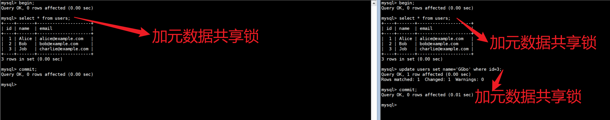

3. 测试：当执行SELECT语句时，添加的是元数据共享锁（SHARED_READ），会阻塞元数据排他锁（EXCLUSIVE），之间是互斥的。

~~~sql
-- 1
mysql> begin;
Query OK, 0 rows affected (0.00 sec)

mysql> select * from users;
+----+-------+---------------------+
| id | name  | email               |
+----+-------+---------------------+
|  1 | Alice | alice@example.com   |
|  2 | Bob   | bob@example.com     |
|  3 | GGbo  | charlie@example.com |
+----+-------+---------------------+
3 rows in set (0.00 sec)

mysql> commit;
Query OK, 0 rows affected (0.00 sec)

-- 2
mysql> begin;
Query OK, 0 rows affected (0.00 sec)

mysql> alter table users add column java int;
Query OK, 0 rows affected (17.90 sec)
Records: 0  Duplicates: 0  Warnings: 0

mysql> select * from users;
+----+-------+---------------------+------+
| id | name  | email               | java |
+----+-------+---------------------+------+
|  1 | Alice | alice@example.com   | NULL |
|  2 | Bob   | bob@example.com     | NULL |
|  3 | GGbo  | charlie@example.com | NULL |
+----+-------+---------------------+------+
3 rows in set (0.00 sec)
~~~

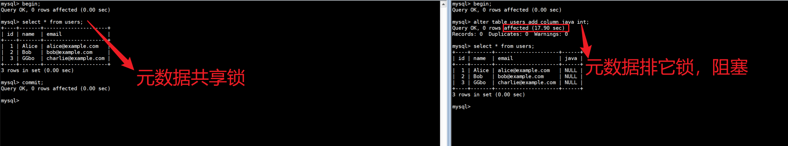

4. 可以通过下面的SQL，来查看数据库中的元数据锁的情况：

~~~sql
select object_type,object_schema,object_name,lock_type,lock_duration from performance_schema.metadata_locks;
~~~

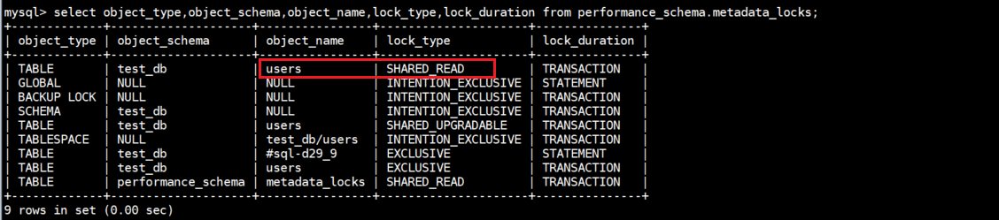

### 3.3.意向锁

>为了避免DML在执行时，加的行锁与表锁的冲突，在InnoDB中引入了意向锁，使得表锁不用检查每行数据是否加锁，使用意向锁来减少表锁的检查。
>
>意向锁是Mysql内部使用的，不需要用户干预。**意向锁和行锁可以共存**，意向锁的主要作用是为了**全表更新数据时提升性能**。否则在全表更新数据的时候，需要先检索该改为是否某些记录上有行锁，那么将是一件非常繁琐且耗时的操作。
>
>作用：表明“某个事务正在某些行持有了锁、或该事务准备去持有锁”，意向锁的存在是为了协调行锁和表锁的关系，支持多粒度（表锁和行锁）的锁共存。

1. 意向锁与读锁（共享锁）和写锁（独占锁）的兼容关系的图表：

| 锁类型          | 意向共享锁 (IS) | 意向独占锁 (IX) | 共享锁 (S) | 独占锁 (X) |
| --------------- | --------------- | --------------- | ---------- | ---------- |
| 意向共享锁 (IS) | 可兼容          | 不可兼容        | 可兼容     | 不可兼容   |
| 意向独占锁 (IX) | 不可兼容        | 不可兼容        | 不可兼容   | 不可兼容   |
| 共享锁 (S)      | 可兼容          | 不可兼容        | 可兼容     | 不可兼容   |
| 独占锁 (X)      | 不可兼容        | 不可兼容        | 不可兼容   | 不可兼容   |

>:bell:注意：
>
>1. 上了行级写锁后，行级写锁不会因为有别的事务上了意向写锁而阻塞，一个Mysql是允许多个行级写锁同时存在的，只要他们不是针对相同的数据。
>2. 一旦事务提交了，意向共享锁、意向排他锁，都会自动释放。

假如没有意向锁，客户端一对表加了行锁后，客户端二如何给表加表锁呢，来通过示意图简单分析一下：

首先客户端一，开启一个事务，然后执行DML操作，在执行DML语句时，会对涉及到的行加行锁。

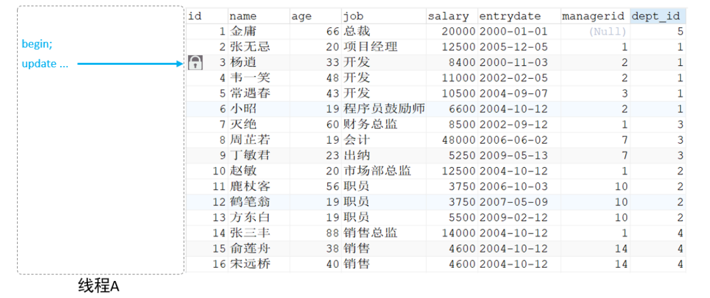

当客户端二，想对这张表加表锁时，会检查当前表是否有对应的行锁，如果没有，则添加表锁，此时就会从第一行数据，检查到最后一行数据，效率较低。

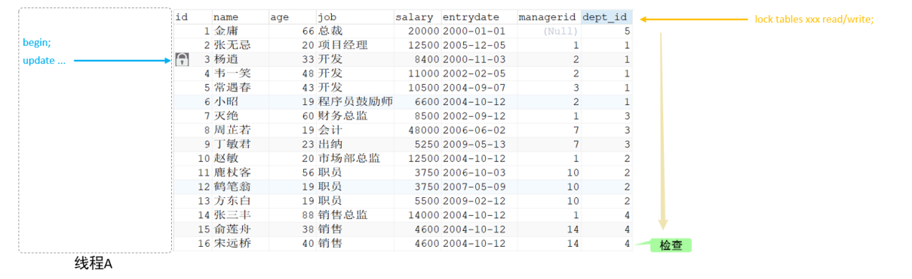

有了意向锁之后，客户端一，在执行DML操作时，会对涉及的行加行锁，同时也会对该表加上意向锁。而其他客户端，在对这张表加表锁的时候，会根据该表上所加的意向锁来判定是否可以成功加表锁，而不用逐行判断行锁情况了。

2. 意向锁分类：
   - **意向共享锁(IS)**: 由语句select ... lock in share mode添加 。 与 表锁共享锁(read)兼容，与表锁排他锁(write)互斥。
   - **意向排他锁(IX)**: 由insert、update、delete、select...for update添加 。与表锁共享锁(read)及排他锁(write)都互斥，意向锁之间不会互斥。

3. 可以通过以下SQL，查看意向锁及行锁的加锁情况：

~~~sql
select object_schema,object_name,index_name,lock_type,lock_mode,lock_data from performance_schema.data_locks;
~~~

4. 测试：意向共享锁与表读锁是兼容的

~~~sql
-- 1
mysql> begin;
Query OK, 0 rows affected (0.00 sec)

mysql> select * from users where id = 1 lock in share mode;
+----+-------+-------------------+------+--------+
| id | name  | email             | java | python |
+----+-------+-------------------+------+--------+
|  1 | Alice | alice@example.com | NULL |   NULL |
+----+-------+-------------------+------+--------+
1 row in set (0.00 sec)

-- 2
mysql> begin;
Query OK, 0 rows affected (0.00 sec)

mysql> select object_schema,object_name,index_name,lock_type,lock_mode,lock_data from performance_schema.data_locks;
+---------------+-------------+------------+-----------+---------------+-----------+
| object_schema | object_name | index_name | lock_type | lock_mode     | lock_data |
+---------------+-------------+------------+-----------+---------------+-----------+
| test_db       | users       | NULL       | TABLE     | IS            | NULL      |
| test_db       | users       | PRIMARY    | RECORD    | S,REC_NOT_GAP | 1         |
+---------------+-------------+------------+-----------+---------------+-----------+
2 rows in set (0.00 sec)

mysql> lock tables users read;
Query OK, 0 rows affected (0.00 sec)
~~~

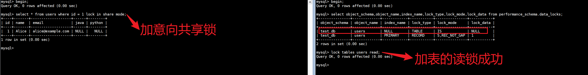

4. 测试：意向排他锁与表读锁、写锁都是互斥的

~~~sql
-- 1
mysql> begin;
Query OK, 0 rows affected (0.00 sec)

mysql> update user set name='Jerayy' where id = 1;
ERROR 1146 (42S02): Table 'test_db.user' doesnt exist
mysql> update users set name='Jerayy' where id = 1;
Query OK, 1 row affected (0.00 sec)
Rows matched: 1  Changed: 1  Warnings: 0

mysql> commit;
Query OK, 0 rows affected (0.00 sec)

-- 2
mysql> begin;
Query OK, 0 rows affected (0.00 sec)

mysql> select object_schema,object_name,index_name,lock_type,lock_mode,lock_data from performance_schema.data_locks;
+---------------+-------------+------------+-----------+---------------+-----------+
| object_schema | object_name | index_name | lock_type | lock_mode     | lock_data |
+---------------+-------------+------------+-----------+---------------+-----------+
| test_db       | users       | NULL       | TABLE     | IX            | NULL      |
| test_db       | users       | PRIMARY    | RECORD    | X,REC_NOT_GAP | 1         |
+---------------+-------------+------------+-----------+---------------+-----------+
2 rows in set (0.00 sec)

mysql> lock tables users read;

^C^C -- query aborted
ERROR 1317 (70100): Query execution was interrupted
mysql> lock tables users write;

Query OK, 0 rows affected (10.79 sec)
~~~

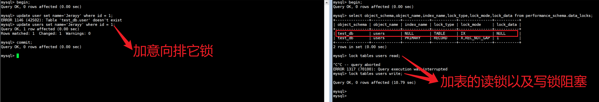

## 4.行级锁

>是由存储引擎来实现的，这里我们主要讲解innoDb的行级锁。InnoDb行锁是通过给索引上的索引项加锁来实现的，因此InnoDB这种行锁实现特点：只有通过索引条件检索的数据，Inn oDb才能使用行级锁，否则，InnoDB将使用表锁！每次操作锁住对应的行数据。锁定粒度最小，发生锁冲突的概率最低，并发度最高。应用在InnoDB存储引擎中。
>
>InnoDB的行级锁，按照**锁定范围**来说，分为3种：
>
>1. 行锁（Record Lock）：锁定单个行记录的锁，防止其他事务对此行进行update和delete。在RC、RR隔离级别下都支持。
>
>   
>
>2. 间隙锁（Gap Lock）：锁定索引记录间隙（不含该记录），确保索引记录间隙不变，防止其他事务在这个间隙进行insert，产生幻读。在RR隔离级别下都支持。
>
>   
>
>3. 临键锁（Next-Key Lock）：行锁和间隙锁组合，同时锁住数据，并锁住数据前面的间隙Gap。在RR隔离级别下支持。
>
>   

### 4.1.行锁

>行锁（Record Lock）：锁定单个行记录的锁，一种用于控制对数据库中单个行的访问的锁机制、防止其他事务对此行进行update和delete。在RC、RR隔离级别下都支持。
>
>InnoDB实现了以下两种类型的行锁：
>
>1. **共享锁（S Lock）**：允许多个事务并发读取行，但不允许写入，阻止其他事务获得相同数据集的排它锁。
>2. **排他锁（X Lock）**：只允许一个事务对行进行写入，其他事务不能读取或写入，阻止其他事务获得相同数据集的共享锁和排他锁。

1. 两种行锁的兼容情况如下:

2. 常见的SQL语句，在执行时，所加的行锁如下：

| **SQL**                       | 行锁类型   | 说明                                     |
| ----------------------------- | ---------- | ---------------------------------------- |
| INSERT ...                    | 排他锁     | 自动加锁                                 |
| UPDATE ...                    | 排他锁     | 自动加锁                                 |
| DELETE ...                    | 排他锁     | 自动加锁                                 |
| SELECT（正常）                | 不加任何锁 |                                          |
| SELECT ... LOCK IN SHARE MODE | 共享锁     | 需要手动在SELECT之后加LOCK IN SHARE MODE |
| SELECT ... FOR UPDATE         | 排他锁     | 需要手动在SELECT之后加FOR UPDATE         |

3. 可以通过以下SQL，查看意向锁及行锁的加锁情况：

~~~sql
select object_schema,object_name,index_name,lock_type,lock_mode,lock_data from performance_schema.data_locks;
~~~

4. 演示环境：默认情况下，InnoDB在 REPEATABLE READ事务隔离级别运行，InnoDB使用 next-key 锁进行搜索和索引扫描，以防止幻读。
   - 针对唯一索引进行检索时，对已存在的记录进行等值匹配时，将会自动优化为行锁。
   - InnoDB的行锁是针对于索引加的锁，不通过索引条件检索数据，那么InnoDB将对表中的所有记录加锁，此时, 就会升级为表锁。
   - 数据准备

~~~sql
CREATE TABLE `stu` (
`id` int NOT NULL PRIMARY KEY AUTO_INCREMENT,
`name` varchar(255) DEFAULT NULL,
`age` int NOT NULL
) ENGINE = InnoDB CHARACTER SET = utf8mb4;
INSERT INTO `stu` VALUES (1, 'tom', 1);
INSERT INTO `stu` VALUES (3, 'cat', 3);
INSERT INTO `stu` VALUES (8, 'rose', 8);
INSERT INTO `stu` VALUES (11, 'jetty', 11);
INSERT INTO `stu` VALUES (19, 'lily', 19);
INSERT INTO `stu` VALUES (25, 'luci', 25);
~~~

5. 普通的select语句，执行时，不会加锁。

~~~sql
-- 1
mysql> begin;
Query OK, 0 rows affected (0.00 sec)

mysql> select * from users;
+----+--------+---------------------+------+--------+
| id | name   | email               | java | python |
+----+--------+---------------------+------+--------+
|  1 | Jerayy | alice@example.com   | NULL |   NULL |
|  2 | Bob    | bob@example.com     | NULL |   NULL |
|  3 | GGbo   | charlie@example.com | NULL |   NULL |
+----+--------+---------------------+------+--------+
3 rows in set (0.00 sec)

-- 2
mysql> select object_schema,object_name,index_name,lock_type,lock_mode,lock_data from performance_schema.data_locks;
Empty set (0.00 sec)

mysql> begin;
Query OK, 0 rows affected (0.00 sec)

mysql> select * from users;
+----+--------+---------------------+------+--------+
| id | name   | email               | java | python |
+----+--------+---------------------+------+--------+
|  1 | Jerayy | alice@example.com   | NULL |   NULL |
|  2 | Bob    | bob@example.com     | NULL |   NULL |
|  3 | GGbo   | charlie@example.com | NULL |   NULL |
+----+--------+---------------------+------+--------+
~~~

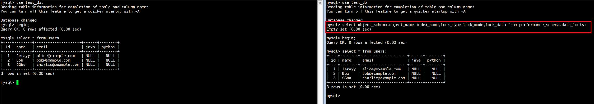

6. select...lock in share mode，加共享锁，共享锁与共享锁之间兼容。

~~~sql
-- 1
mysql> begin;
Query OK, 0 rows affected (0.00 sec)

mysql> select * from stu where id = 1 lock in share mode;
+----+------+-----+
| id | name | age |
+----+------+-----+
|  1 | tom  |   1 |
+----+------+-----+
1 row in set (0.00 sec)

-- 2
mysql> select object_schema,object_name,index_name,lock_type,lock_mode,lock_data from performance_schema.data_locks;
+---------------+-------------+------------+-----------+---------------+-----------+
| object_schema | object_name | index_name | lock_type | lock_mode     | lock_data |
+---------------+-------------+------------+-----------+---------------+-----------+
| test_db       | stu         | NULL       | TABLE     | IS            | NULL      |
| test_db       | stu         | PRIMARY    | RECORD    | S,REC_NOT_GAP | 1         |
+---------------+-------------+------------+-----------+---------------+-----------+
2 rows in set (0.00 sec)

mysql> select * from stu where id = 1 lock in share mode;
+----+------+-----+
| id | name | age |
+----+------+-----+
|  1 | tom  |   1 |
+----+------+-----+
1 row in set (0.00 sec)

mysql> select object_schema,object_name,index_name,lock_type,lock_mode,lock_data from performance_schema.data_locks;
+---------------+-------------+------------+-----------+---------------+-----------+
| object_schema | object_name | index_name | lock_type | lock_mode     | lock_data |
+---------------+-------------+------------+-----------+---------------+-----------+
| test_db       | stu         | NULL       | TABLE     | IS            | NULL      |
| test_db       | stu         | PRIMARY    | RECORD    | S,REC_NOT_GAP | 1         |
+---------------+-------------+------------+-----------+---------------+-----------+
~~~

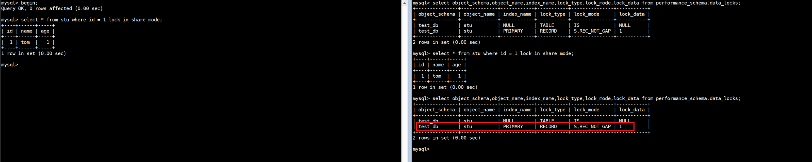

7. 共享锁与排他锁之间互斥。

~~~sql
-- 1
mysql> begin;
Query OK, 0 rows affected (0.00 sec)

mysql> select * from stu where id = 1 lock in share mode;
+----+------+-----+
| id | name | age |
+----+------+-----+
|  1 | tom  |   1 |
+----+------+-----+
1 row in set (0.00 sec)

mysql> select object_schema,object_name,index_name,lock_type,lock_mode,lock_data from performance_schema.data_locks;
+---------------+-------------+------------+-----------+---------------+-----------+
| object_schema | object_name | index_name | lock_type | lock_mode     | lock_data |
+---------------+-------------+------------+-----------+---------------+-----------+
| test_db       | stu         | NULL       | TABLE     | IX            | NULL      |
| test_db       | stu         | PRIMARY    | RECORD    | X,REC_NOT_GAP | 3         |
| test_db       | stu         | PRIMARY    | RECORD    | X,REC_NOT_GAP | 1         |
| test_db       | stu         | NULL       | TABLE     | IS            | NULL      |
| test_db       | stu         | PRIMARY    | RECORD    | S,REC_NOT_GAP | 1         |
+---------------+-------------+------------+-----------+---------------+-----------+
mysql> commit;
Query OK, 0 rows affected (0.00 sec)

mysql> select object_schema,object_name,index_name,lock_type,lock_mode,lock_data from performance_schema.data_locks;
Empty set (0.00 sec)

-- 2
mysql> begin;
Query OK, 0 rows affected (0.00 sec)

mysql> select object_schema,object_name,index_name,lock_type,lock_mode,lock_data from performance_schema.data_locks;
+---------------+-------------+------------+-----------+---------------+-----------+
| object_schema | object_name | index_name | lock_type | lock_mode     | lock_data |
+---------------+-------------+------------+-----------+---------------+-----------+
| test_db       | stu         | NULL       | TABLE     | IS            | NULL      |
| test_db       | stu         | PRIMARY    | RECORD    | S,REC_NOT_GAP | 1         |
+---------------+-------------+------------+-----------+---------------+-----------+
2 rows in set (0.00 sec)

mysql> update stu set name = 'java' where id = 3;
Query OK, 1 row affected (0.00 sec)
Rows matched: 1  Changed: 1  Warnings: 0

mysql> update stu set name = 'java' where id = 1;
ERROR 1205 (HY000): Lock wait timeout exceeded; try restarting transaction
mysql> select object_schema,object_name,index_name,lock_type,lock_mode,lock_data from performance_schema.data_locks;
+---------------+-------------+------------+-----------+---------------+-----------+
| object_schema | object_name | index_name | lock_type | lock_mode     | lock_data |
+---------------+-------------+------------+-----------+---------------+-----------+
| test_db       | stu         | NULL       | TABLE     | IX            | NULL      |
| test_db       | stu         | PRIMARY    | RECORD    | X,REC_NOT_GAP | 3         |
| test_db       | stu         | NULL       | TABLE     | IS            | NULL      |
| test_db       | stu         | PRIMARY    | RECORD    | S,REC_NOT_GAP | 1         |
+---------------+-------------+------------+-----------+---------------+-----------+
4 rows in set (0.00 sec)

mysql> commit;
Query OK, 0 rows affected (0.01 sec)

mysql> select object_schema,object_name,index_name,lock_type,lock_mode,lock_data from performance_schema.data_locks;
+---------------+-------------+------------+-----------+---------------+-----------+
| object_schema | object_name | index_name | lock_type | lock_mode     | lock_data |
+---------------+-------------+------------+-----------+---------------+-----------+
| test_db       | stu         | NULL       | TABLE     | IS            | NULL      |
| test_db       | stu         | PRIMARY    | RECORD    | S,REC_NOT_GAP | 1         |
+---------------+-------------+------------+-----------+---------------+-----------+
2 rows in set (0.00 sec)
~~~

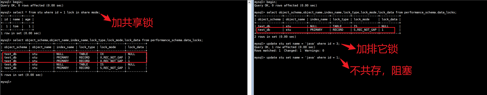

>客户端一获取的是id为1这行的共享锁，客户端二是可以获取id为3这行的排它锁的，因为不是同一行数据。 而如果客户端二想获取id为1这行的排他锁，会处于阻塞状态，以为共享锁与排他锁之间互斥。

8. 排它锁与排他锁之间互斥

~~~sql
-- 1
mysql> begin;
Query OK, 0 rows affected (0.00 sec)

mysql> update stu set name = 'python' where id = 1;    
Query OK, 1 row affected (0.01 sec)
Rows matched: 1  Changed: 1  Warnings: 0

mysql> commit;
Query OK, 0 rows affected (0.00 sec)

-- 2
mysql> begin;
Query OK, 0 rows affected (0.00 sec)

mysql> update stu set name = 'python' where id = 1; 
Query OK, 0 rows affected (11.89 sec)
Rows matched: 1  Changed: 0  Warnings: 0
~~~

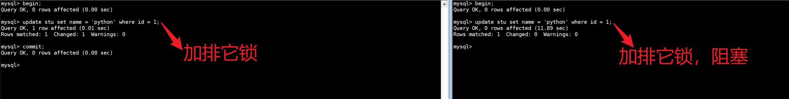

>当客户端一，执行update语句，会为id为1的记录加排他锁； 客户端二，如果也执行update语句更新id为1的数据，也要为id为1的数据加排他锁，但是客户端二会处于阻塞状态，因为排他锁之间是互斥的。 直到客户端一，把事务提交了，才会把这一行的行锁释放，此时客户端二，解除阻塞。

9. 无索引行锁升级为表锁

~~~sql
-- stu表如下：
mysql> select * from stu;
+----+--------+-----+
| id | name   | age |
+----+--------+-----+
|  1 | python |   1 |
|  3 | java   |   3 |
|  8 | rose   |   8 |
| 11 | jetty  |  11 |
| 19 | lily   |  19 |
| 25 | luci   |  25 |
+----+--------+-----+
6 rows in set (0.00 sec)

mysql> desc stu;
+-------+--------------+------+-----+---------+----------------+
| Field | Type         | Null | Key | Default | Extra          |
+-------+--------------+------+-----+---------+----------------+
| id    | int          | NO   | PRI | NULL    | auto_increment |
| name  | varchar(255) | YES  |     | NULL    |                |
| age   | int          | NO   |     | NULL    |                |
+-------+--------------+------+-----+---------+----------------+
3 rows in set (0.01 sec)
~~~

~~~sql
-- 1
mysql> begin;
Query OK, 0 rows affected (0.00 sec)

mysql> update stu set name = 'Lei' where name = 'lily';
Query OK, 1 row affected (0.01 sec)
Rows matched: 1  Changed: 1  Warnings: 0

mysql> commit;
Query OK, 0 rows affected (0.01 sec)

-- 2
mysql> begin;
Query OK, 0 rows affected (0.00 sec)

mysql> update stu set name = 'PHP' where id = 3;
commit;
Query OK, 1 row affected (12.65 sec)
Rows matched: 1  Changed: 1  Warnings: 0

mysql> commit;
Query OK, 0 rows affected (0.00 sec)
~~~

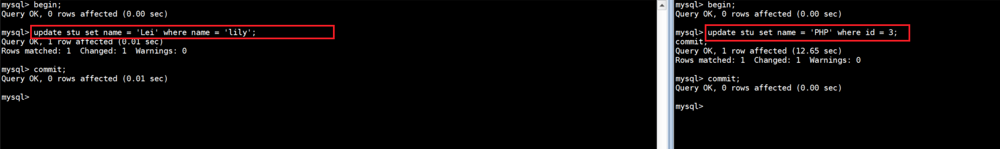

>在客户端一中，开启事务，并执行update语句，更新name为Lily的数据，也就是id为19的记录 。然后在客户端二中更新id为3的记录，却不能直接执行，会处于阻塞状态，为什么呢？
>
>原因就是因为此时，客户端一，根据name字段进行更新时，name字段是没有索引的，如果没有索引，此时行锁会升级为表锁(因为行锁是对索引项加的锁，而name没有索引)。

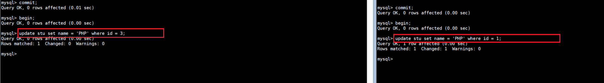

>id字段有索引， 则不加锁。再针对name字段建立索引，索引建立之后，再次做一个测试。

~~~sql
-- 1
mysql> create index idx_stu_name on stu(name);
Query OK, 0 rows affected (0.02 sec)
Records: 0  Duplicates: 0  Warnings: 0
mysql> begin;
Query OK, 0 rows affected (0.00 sec)

mysql> update stu set name = 'Lily' where name = 'Lei';
Query OK, 1 row affected (0.00 sec)
Rows matched: 1  Changed: 1  Warnings: 0

-- 2
mysql> begin;
Query OK, 0 rows affected (0.00 sec)
mysql> update stu set name = 'Golang' where id = 3; 
Query OK, 1 row affected (0.00 sec)
Rows matched: 1  Changed: 1  Warnings: 0

mysql> select * from stu;
+----+--------+-----+
| id | name   | age |
+----+--------+-----+
|  1 | PHP    |   1 |
|  3 | Golang |   3 |
|  8 | rose   |   8 |
| 11 | jetty  |  11 |
| 19 | Lei    |  19 |
| 25 | luci   |  25 |
+----+--------+-----+
6 rows in set (0.00 sec)
~~~

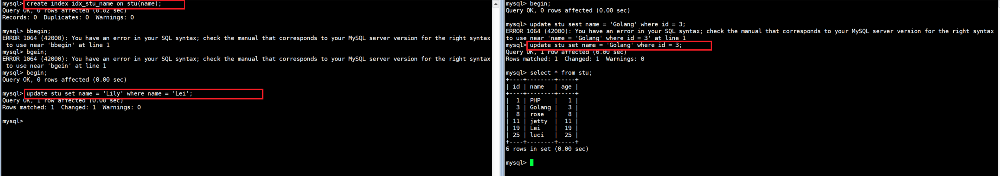

>客户端一，开启事务，然后依然是根据name进行更新。而客户端二，在更新id为3的数据时，更新成功，并未进入阻塞状态。 这样就说明，我们根据索引字段进行更新操作，就可以避免行锁升级为表锁的情况。

### 4.2.间隙锁&临键锁

>是一种用于控制对索引间隙的访问的锁，默认情况下，InnoDB在 REPEATABLE READ事务隔离级别运行，InnoDB使用 next-key 锁进行搜索和索引扫描，主要用于防止幻读现象。
>
>1. 索引上的等值查询(唯一索引)，给不存在的记录加锁时, 优化为间隙锁 。
>2. 索引上的等值查询(非唯一普通索引)，向右遍历时最后一个值不满足查询需求时，next-key lock 退化为间隙锁。
>3. 索引上的范围查询(唯一索引)--会访问到不满足条件的第一个值为止。

>:bell:间隙锁唯一目的是防止其他事务插入间隙。间隙锁可以共存，一个事务采用的间隙锁不会阻止另一个事务在同一间隙上采用间隙锁。

1. 索引上的等值查询(唯一索引)，给不存在的记录加锁时, 优化为间隙锁 。

~~~sql
-- 1
mysql> select * from stu;
+----+--------+-----+
| id | name   | age |
+----+--------+-----+
|  1 | PHP    |   1 |
|  3 | Golang |   3 |
|  8 | rose   |   8 |
| 11 | jetty  |  11 |
| 19 | Lily   |  19 |
| 25 | luci   |  25 |
+----+--------+-----+
6 rows in set (0.00 sec)

mysql> begin;
Query OK, 0 rows affected (0.00 sec)

mysql> update stu set age = 10 where id = 5;
Query OK, 0 rows affected (0.00 sec)
Rows matched: 0  Changed: 0  Warnings: 0

mysql> commit;
Query OK, 0 rows affected (0.00 sec)

-- 2
mysql> select object_schema,object_name,index_name,lock_type,lock_mode,lock_data from performance_schema.data_locks;
Empty set (0.00 sec)

mysql> select object_schema,object_name,index_name,lock_type,lock_mode,lock_data from performance_schema.data_locks;
+---------------+-------------+------------+-----------+-----------+-----------+
| object_schema | object_name | index_name | lock_type | lock_mode | lock_data |
+---------------+-------------+------------+-----------+-----------+-----------+
| test_db       | stu         | NULL       | TABLE     | IX        | NULL      |
| test_db       | stu         | PRIMARY    | RECORD    | X,GAP     | 8         |
+---------------+-------------+------------+-----------+-----------+-----------+
2 rows in set (0.00 sec)

mysql> begin;
Query OK, 0 rows affected (0.00 sec)

mysql> insert into stu values(7,'Ruby',7);
Query OK, 1 row affected (19.08 sec)

mysql> select * from stu;
+----+--------+-----+
| id | name   | age |
+----+--------+-----+
|  1 | PHP    |   1 |
|  3 | Golang |   3 |
|  7 | Ruby   |   7 |
|  8 | rose   |   8 |
| 11 | jetty  |  11 |
| 19 | Lily   |  19 |
| 25 | luci   |  25 |
+----+--------+-----+
~~~

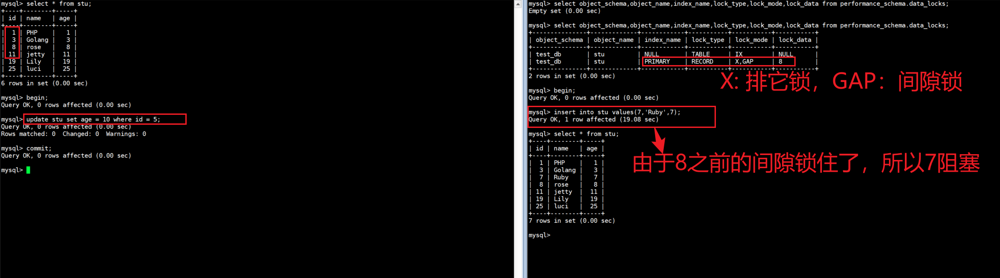

2. 索引上的等值查询(非唯一普通索引)，向右遍历时最后一个值不满足查询需求时，next-key lock 退化为间隙锁。 

>InnoDB的B+树索引，叶子节点是有序的双向链表。 要根据这个二级索引查询值为18的数据，并加上共享锁，是只锁定18这一行就可以了吗？
>
>不是，因为是非唯一索引，这个结构中可能有多个18的存在，所以，在加锁时会继续往后找，找到一个不满足条件的值。此时会对18加临键锁，并对29之前的间隙加锁。

~~~sql
-- 1
mysql> select * from stu;
+----+--------+-----+
| id | name   | age |
+----+--------+-----+
|  1 | PHP    |   1 |
|  3 | Golang |   3 |
|  7 | Ruby   |   7 |
|  8 | rose   |   8 |
| 11 | jetty  |  11 |
| 19 | Lily   |  19 |
| 25 | luci   |  25 |
+----+--------+-----+
7 rows in set (0.00 sec)

mysql> create index idx_stu_age on stu(age);

mysql> select * from stu where age = 3 lock in share mode; 
+----+--------+-----+
| id | name   | age |
+----+--------+-----+
|  3 | Golang |   3 |
+----+--------+-----+
1 row in set (0.00 sec)

mysql> begin;
Query OK, 0 rows affected (0.00 sec)

mysql> select * from stu where age = 3 lock in share mode;
+----+--------+-----+
| id | name   | age |
+----+--------+-----+
|  3 | Golang |   3 |
+----+--------+-----+
1 row in set (0.00 sec)

-- 2

mysql> select object_schema,object_name,index_name,lock_type,lock_mode,lock_data from performance_schema.data_locks;
+---------------+-------------+-------------+-----------+---------------+-----------+
| object_schema | object_name | index_name  | lock_type | lock_mode     | lock_data |
+---------------+-------------+-------------+-----------+---------------+-----------+
| test_db       | stu         | NULL        | TABLE     | IS            | NULL      |
| test_db       | stu         | idx_stu_age | RECORD    | S             | 3, 3      |
| test_db       | stu         | PRIMARY     | RECORD    | S,REC_NOT_GAP | 3         |
| test_db       | stu         | idx_stu_age | RECORD    | S,GAP         | 7, 7      |
+---------------+-------------+-------------+-----------+---------------+-----------+
4 rows in set (0.00 sec)
~~~

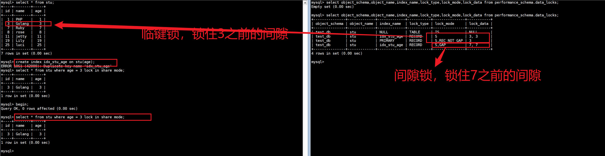

3. 索引上的范围查询(唯一索引)--会访问到不满足条件的第一个值为止。

~~~SQL
-- 1
mysql> select * from stu;
+----+--------+-----+
| id | name   | age |
+----+--------+-----+
|  1 | PHP    |   1 |
|  3 | Golang |   3 |
|  7 | Ruby   |   7 |
|  8 | rose   |   8 |
| 11 | jetty  |  11 |
| 19 | Lily   |  19 |
| 25 | luci   |  25 |
+----+--------+-----+
7 rows in set (0.00 sec)

mysql> begin;
Query OK, 0 rows affected (0.00 sec)

mysql> select * from stu where id >= 19 lock in share mode;
+----+------+-----+
| id | name | age |
+----+------+-----+
| 19 | Lily |  19 |
| 25 | luci |  25 |
+----+------+-----+
2 rows in set (0.00 sec)

-- 2
mysql> select object_schema,object_name,index_name,lock_type,lock_mode,lock_data from performance_schema.data_locks;
+---------------+-------------+------------+-----------+---------------+------------------------+
| object_schema | object_name | index_name | lock_type | lock_mode     | lock_data              |
+---------------+-------------+------------+-----------+---------------+------------------------+
| test_db       | stu         | NULL       | TABLE     | IS            | NULL                   |
| test_db       | stu         | PRIMARY    | RECORD    | S,REC_NOT_GAP | 19                     |
| test_db       | stu         | PRIMARY    | RECORD    | S             | supremum pseudo-record |
| test_db       | stu         | PRIMARY    | RECORD    | S             | 25                     |
+---------------+-------------+------------+-----------+---------------+------------------------+
4 rows in set (0.00 sec)
~~~

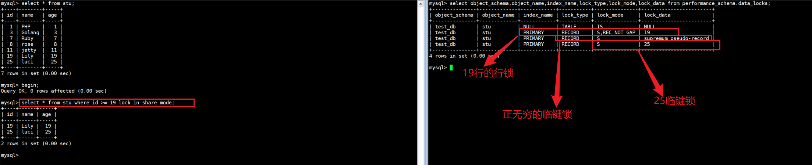

>查询的条件为id>=19，并添加共享锁。 此时，可以根据数据库表中现有的数据，将数据分为三个部:
>
>1. [19]
>2. (19,25]
>3. (25,+∞]
>
>所以数据库数据在加锁是，就是将19加了行锁，25的临键锁（包含25及25之前的间隙），正无穷的临键锁(正无穷及之前的间隙)。

## 5.乐观锁和悲观锁

乐观锁和悲观锁主要是事务并发控制的策略，并不直接归类于行级锁或表级锁。

### 5.1.乐观锁

>1. 概念：乐观锁是相对悲观锁而言的，乐观锁假设数据一般情况下不会造成冲突，所以在数据进行提交更新的时候，才会正式对数据的冲突与否进行检测，如果发现冲突了，则返回给用户错误的信息，让用户决定如何去做。
>2. 应用场景：适合并发量较小，冲突概率低的场景。因为如果出现大量的写操作，写冲突的可能性就会增大，业务层需要不断重试，会大大降低系统性能。

1. 版本号控制：在表中添加一个版本号字段，每次更新时检查版本号是否一致。

~~~sql
-- 更新前检查版本号
UPDATE your_table SET column1 = 'new_value', version = version + 1 WHERE id = 1 AND version = current_version;
~~~

2. 时间戳控制：使用时间戳记录数据的最后更新时间，更新时检查时间戳。

~~~sql
-- 更新前检查时间戳
UPDATE your_table SET column1 = 'new_value', updated_at = NOW() WHERE id = 1 AND updated_at = last_updated_time;
~~~

### 5.2.悲观锁

>1. 概念：悲观锁假设在数据操作期间会发生冲突，具有强烈的独占和排他特性，因此，在整个数据处理过程中，将数据处于锁定状态。确保数据的安全性。
>2. 应用场景：适合并发量较大，冲突概率高的场景。

1. 行级锁：使用 SQL 语句 `SELECT ... FOR UPDATE`：在读取数据时对其加锁，防止其他事务修改。

~~~sql
BEGIN;

SELECT * FROM your_table WHERE id = 1 FOR UPDATE;

-- 执行修改操作

COMMIT;
~~~

2. 表级锁：使用 `LOCK TABLES` 命令：在整个表上加锁，确保其他事务无法读写该表。

~~~sql
LOCK TABLES your_table WRITE;

-- 执行操作

UNLOCK TABLES;
~~~

