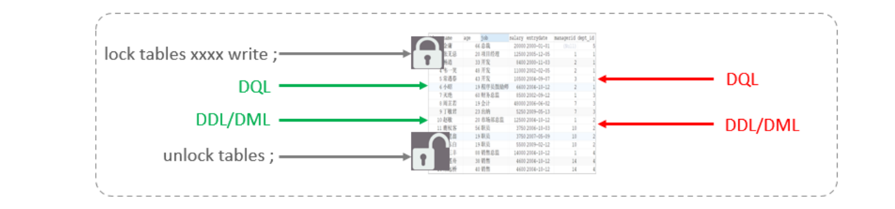

# 锁

## 1.概念

>锁是计算机协调多个进程或线程并发访问某一资源的机制。在数据库中，除传统的计算资源（CPU、RAM、I/O）的争用以外，数据也是一种供许多用户共享的资源。如何保证数据并发访问的一致性、有效性是所有数据库必须解决的一个问题，锁冲突也是影响数据库并发访问性能的一个重要因素。
>
>锁是计算机在执行多线程或线程时用于并发访问同一共享资源时的同步机制，MySQL中的锁是在服务器层或者存储引擎层实现的，保证了数据访问的一致性与有效性。

1. MySQL中的锁，按照锁的粒度分，分为以下三类：
   - 全局锁：对整个数据库实例加锁。
   - 表级锁：当前操作的整张表加锁，最常使用的 MyISAM 与 InnoDB 都支持表级锁定。
   - 行级锁：行级锁是粒度最低的锁，发生锁冲突的概率也最低、并发度最高。但是加锁慢、开销大，容易发生死锁现象。
2. InnoDB 存储引擎同时支持行级锁（row-level locking）和表级锁（table-level locking），默认情况下采用行级锁。
3. 表级锁适用于并发较低、以查询为主的应用，例如中小型的网站；MyISAM 和 MEMORY 存储引擎采用表级锁。
4. 行级锁适用于按索引条件高并发更新少量不同数据，同时又有并发查询的应用，例如 OLTP 系统；InnoDB 和 NDB 存储引擎实现了行级锁。

## 2.全局锁

1. 概念：
   - 全局锁是**对整个数据库实例加锁**，**加锁后整个实例就处于只读状态**，后续DML的写语句，DDL语句，已经更新操作的事务提交语句都会被阻塞。其典型的使用场景是做**全库的逻辑备份**，对所有的表进行锁定，从而获取一致性视图，保证数据的完整性。
2. 特点：
   - **锁定范围**：全局锁会锁定整个数据库实例，其他任何事务都无法对数据库执行读写操作，直到锁被释放。
   - **阻塞其他操作**：在全局锁定期间，所有对数据库的操作（包括读和写）都会被阻塞，从而保证在执行关键任务时数据的一致性。
   - **性能影响**：由于全局锁会阻塞所有操作，因此在使用时需要谨慎，以避免对系统性能造成严重影响。
3. 注意事项：
   - 使用全局锁时要小心，因为它会影响到数据库的可用性。尽量缩小锁的持有时间，以减少对其他操作的影响。
   - 在高并发环境下，使用全局锁可能会导致严重的性能瓶颈，建议根据实际情况评估其必要性。

~~~sql
-- 1、加全局锁
mysql> flush tables with read lock ;

-- 2、释放锁
mysql> unlock tables ;
~~~

## 3.表级锁

1. 概念：
   - 表级锁（Table Lock）是MySQL中一种锁定机制，用于控制对整个表的访问。表级锁主要用于在执行特定操作时保证数据的一致性和完整性。
2. 分类：
   - **表锁**：用于控制对整个表的访问。表锁可以分为两种主要类型
     - **表共享读锁（Read Lock）**：允许多个事务同时读取表的数据，但不允许任何事务对表进行写入。获得共享锁的事务可以并发读取，但无法进行更新操作。
     - **表独占写锁（Write Lock）**：只允许一个事务对表进行写入，其他事务既不能读取也不能写入。获取独占锁的事务会阻塞所有其他事务的读写操作。
   - **意向锁（Intention Lock）**：用于支持多粒度锁（如行级锁和表级锁）的一种机制，主要用于解决锁的兼容性问题，确保在不同级别的锁之间能够正确协作。
     - **意向共享锁（IS）**：表示一个事务希望对某些行加共享锁，但希望在表级别上获得共享锁。允许其他事务在同一表上也加意向共享锁，但不允许加意向排他锁。
     - **意向排他锁（IX）**：表示一个事务希望对某些行加排他锁，同时希望在表级别上获得排他锁。允许其他事务加意向共享锁或意向排他锁，但不允许其他事务对该表加排他锁。
   - **元数据锁（meta data lock, MDL）**：用于保护数据库对象（如表和数据库）的结构性操作的一种锁机制。它确保在对表结构进行修改时，其他事务无法对该表进行读写操作，主要作用是维护表元数据的数据一致性，在表上有活动事务的时候，不可以对元数据进行写入操作。为了避免DML与DDL冲突，保证读写的正确性。
     - 当对表做增删改查操作时加元数据读锁。允许多个事务同时读取表的元数据，但在有事务持有读锁时，不允许有事务获取写锁。
     - 当对表做结构变更操作的时候加元数据写锁。当一个事务对表进行修改时，会获取写锁，阻止其他事务对该表的读取和写入。
     - 在执行DDL语句时，MySQL会自动获取元数据锁，确保在表结构被修改的期间，其他事务不会对该表进行读取或写入。

### 3.1.表锁

1. 语法：

~~~sql
-- 1、表共享读锁（Read Lock）
## 加锁
LOCK TABLES table_name READ;

## 释放锁
UNLOCK TABLES;

-- 2、表独占写锁（Write Lock）
## 加锁
LOCK TABLES table_name WRITE;

## 释放锁
UNLOCK TABLES;
~~~

2. 测试读锁：左侧为客户端一，对指定表加了读锁，不会影响右侧客户端二的读，但是会阻塞右侧客户端的写。

~~~sql
-- 1、客户端一
mysql> LOCK TABLES users READ;          
Query OK, 0 rows affected (0.00 sec)

mysql> select * from users;
+----+-------+---------------------+
| id | name  | email               |
+----+-------+---------------------+
|  1 | Alice | alice@example.com   |
|  2 | Bob   | bob@example.com     |
|  3 | Mmban | charlie@example.com |
+----+-------+---------------------+
3 rows in set (0.00 sec)

mysql> update users set name='GGbo' where id=3;              
ERROR 1099 (HY000): Table 'users' was locked with a READ lock and can t be updated
mysql> UNLOCK TABLES;
Query OK, 0 rows affected (0.00 sec)

mysql> select * from users;
+----+-------+---------------------+
| id | name  | email               |
+----+-------+---------------------+
|  1 | Alice | alice@example.com   |
|  2 | Bob   | bob@example.com     |
|  3 | GGbo  | charlie@example.com |
+----+-------+---------------------+
3 rows in set (0.00 sec)

-- 2、客户端二
mysql> select * from users;
+----+-------+---------------------+
| id | name  | email               |
+----+-------+---------------------+
|  1 | Alice | alice@example.com   |
|  2 | Bob   | bob@example.com     |
|  3 | Mmban | charlie@example.com |
+----+-------+---------------------+
3 rows in set (0.00 sec)

mysql> select * from users;
+----+-------+---------------------+
| id | name  | email               |
+----+-------+---------------------+
|  1 | Alice | alice@example.com   |
|  2 | Bob   | bob@example.com     |
|  3 | Mmban | charlie@example.com |
+----+-------+---------------------+
3 rows in set (0.00 sec)

mysql> update users set name='GGbo' where id=3;
Query OK, 1 row affected (4.63 sec)
Rows matched: 1  Changed: 1  Warnings: 0
~~~

3. 测试写锁：左侧为客户端一，对指定表加了写锁，会阻塞右侧客户端的读和写。

~~~sql
-- 1、客户端一
mysql> LOCK TABLES users WRITE;          
Query OK, 0 rows affected (0.00 sec)

mysql> select * from users;
+----+-------+---------------------+
| id | name  | email               |
+----+-------+---------------------+
|  1 | Alice | alice@example.com   |
|  2 | Bob   | bob@example.com     |
|  3 | GGbo  | charlie@example.com |
+----+-------+---------------------+
3 rows in set (0.00 sec)

mysql> update users set name='Mmban' where id=3;    
Query OK, 1 row affected (0.00 sec)
Rows matched: 1  Changed: 1  Warnings: 0

mysql> UNLOCK TABLES;
Query OK, 0 rows affected (0.00 sec)

mysql> select * from users;
+----+-------+---------------------+
| id | name  | email               |
+----+-------+---------------------+
|  1 | Alice | alice@example.com   |
|  2 | Bob   | bob@example.com     |
|  3 | Job   | charlie@example.com |
+----+-------+---------------------+
3 rows in set (0.00 sec)

-- 2、客户端二
mysql> select * from users;
^C^C -- query aborted
ERROR 1317 (70100): Query execution was interrupted
mysql> update users set name='Job' where id=3;        
Query OK, 1 row affected (8.27 sec)
Rows matched: 1  Changed: 1  Warnings: 0

mysql> select * from users;
+----+-------+---------------------+
| id | name  | email               |
+----+-------+---------------------+
|  1 | Alice | alice@example.com   |
|  2 | Bob   | bob@example.com     |
|  3 | Job   | charlie@example.com |
+----+-------+---------------------+
3 rows in set (0.00 sec)
~~~

4. 结论: 读锁不会阻塞其他客户端的读，但是会阻塞写。写锁既会阻塞其他客户端的读，又会阻塞其他客户端的写。