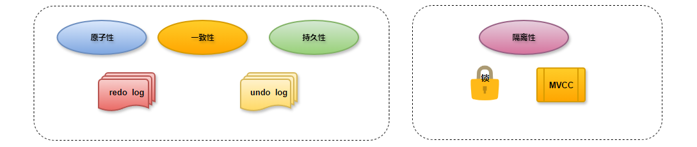
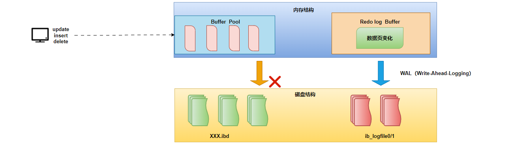
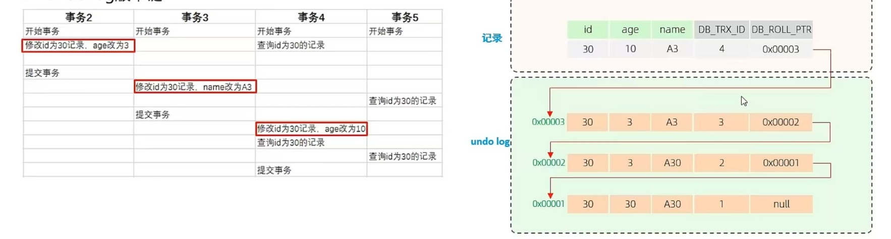
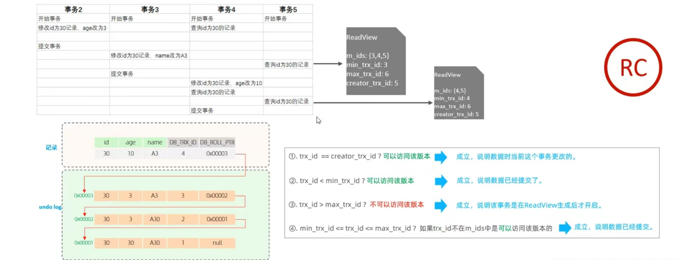
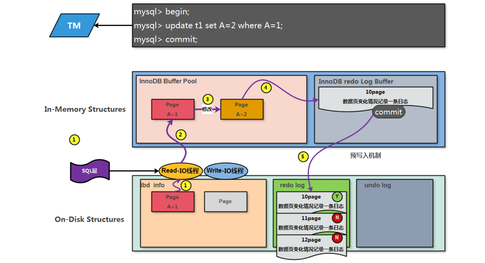
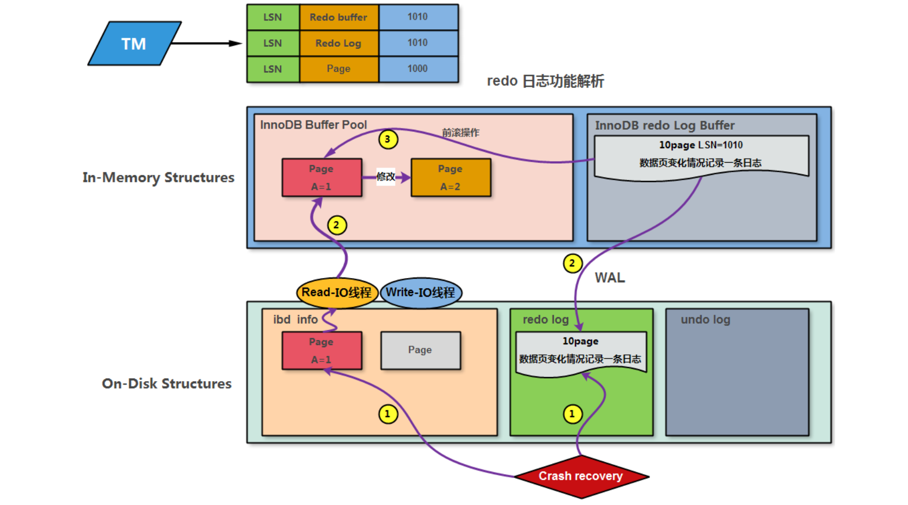
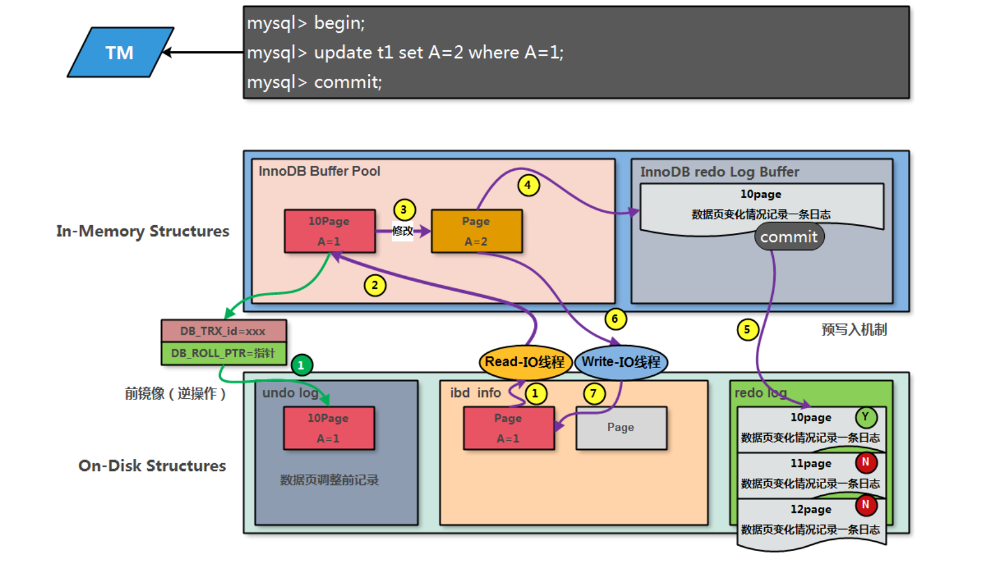
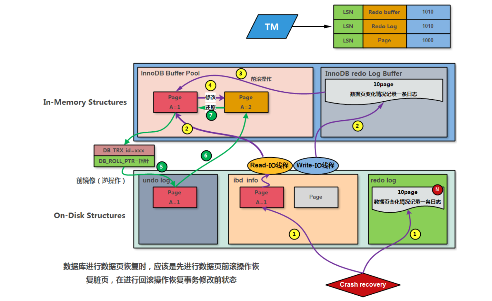
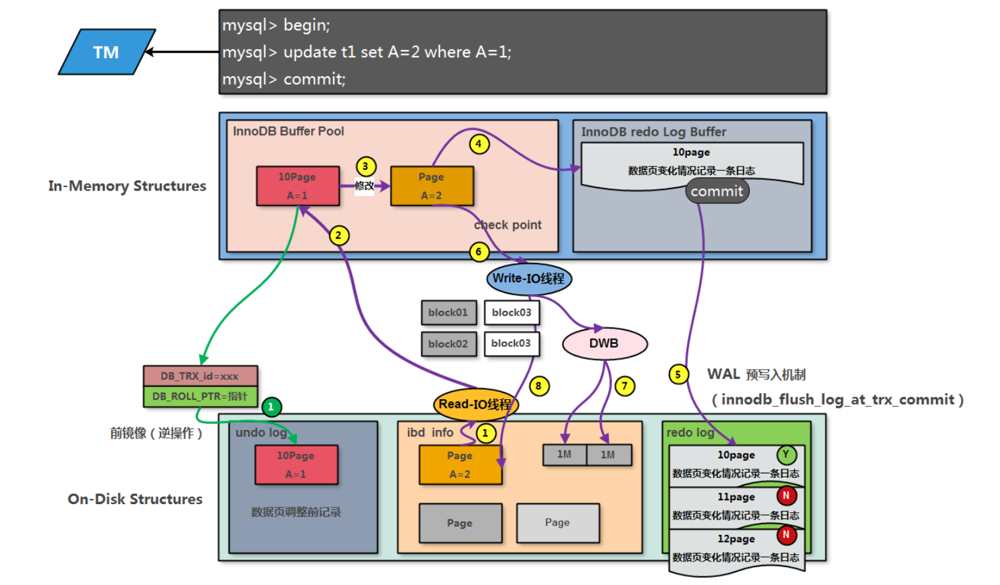
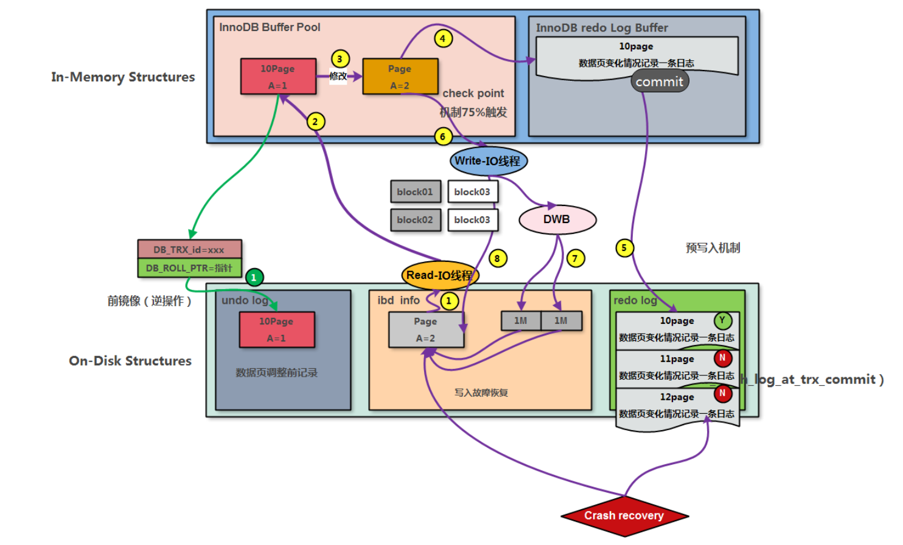

# 事务工作原理

## 1.前置知识

1. 为了确保事务的 ACID 特性，MySQL 使用了一系列机制，包括 MVCC（多版本并发控制）和锁。

2. **redo log**：重做日志，记录的是事务提交时数据页的物理修改，是用来实现事务的持久性。该日志文件由两部分组成:重做日志缓冲(redolog buffer)以及重做日志文件(redolog file),前者是在内存中，后者在磁盘中。当事务提交之后会把所有修改信息都存到该日志文件中,用于在刷新脏页到磁盘,发生错误时,进行数据恢复使用。
   - **redo log file**：当出现异常情况，内存中数据直接写入磁盘失败时，可以通过重启数据库服务，读取此文件修复数据信息；文件存储表项为：ib_logfile0~N    默认48M，轮询使用。
   - **redo log buffer**：表示重做日志生成缓冲区，相当于redo log的内存区域。redo log文件与redo log buffer是有IO关系的；
     - 事务修改提交后：redo log buffer -> redo log，表示写入数据到redo log；
     - 事务操作恢复时：redo log -> redo log buffer，表示读取数据从redo log；

3. **undo log**：回滚日志，用于记录数据被修改前的信息，作用包含两个:提供回滚 和 MVCC(多版本并发控制)。undolog和redolog记录物理日志不一样，它是逻辑日志。可以认为当delete一条记录时，undolog中会记录一条对应的insert记录，反之亦然，当update一条记录时，它记录一条对应相反的update记录。当执行rollback时，就可以从undolog中的逻辑记录读取到相应的内容并进行回滚。
   - undolog销毁:undolog在事务执行时产生，事务提交时，并不会立即删除undolog，因为这些日志可能还用于MVCC。
   - undolog存储:undol0g采用段的方式进行管理和记录，存放在前面介绍的rolbacksegment 回滚段中，内部包含1024个undolog  segment。
4. **tablespace file**：表示存储表数据行和索引等信息的文件，含有表空间所有数据文件；ibd。
5. **Innodb buffer pool**：表示数据缓冲区，主要用于缓冲事务要处理的数据和索引信息，tablespace文件与buffer pool是有IO关系的。
6. **LSN**：表示日志序列号，在buffer pool中有数据页信息的变化就会记录到redo log buffer中，主要记录变化了多少字节量；利用LSN记录相应数据页的变化量(LSN+变化字节量)，也可以理解为记录的是日志量的变化；MySQL每次数据库启动，都会比较磁盘数据页和redolog的LSN，必须要求两者一致，数据库才能正常启动。
7. **WAL（Write Ahead Log）**：是一种日志记录机制，表示redo日志生成记录优先于数据页写入到磁盘的过程，并且是支持预写入机制（group commit）的

## 2.MVCC-基本概念

1. 当前读：读取的是记录的最新版本，读取时还要保证其他并发事务不能修改当前记录，会对读取的记录进行加锁。对于我们日常的操作，如: select .. lock in share mode(共享锁),select ... for update、update、insert、delete(排他锁)都是一种当前读。
2. 快照读：简单的select(不加锁)就是快照读，快照读，读取的是记录数据的可见版本，有可能是历史数据，不加锁，是非阻塞读。
   - Read committed:每次select，都生成一个快照读。
   - Repeatable Read:开启事务后第一个select语句才是快照读的地方。
   - Serializable:快照读会退化为当前读。
3. MVCC：全称 Multi-Version Concurrency Control，多版本并发控制。指维护一个数据的多个版本，使得读写操作没有冲突，快照读为MVSOL实现MVCC提供了一个非阻塞读功能。MVCC的具体实现，还需要依赖于数据库记录中的三个隐式字段、undo log日志、readView。

### 2.1.MVCC实现原理

#### 2.1.1.三个隐藏字段

1. 在数据库的 MVCC 机制中，通常会有三个隐藏字段，用于管理事务的版本和状态。这些字段帮助数据库系统跟踪每个数据行的版本和相关的事务信息。
   - **DB TRX_ID**：用于标识对某一行数据进行修改的事务，记录插入这条记录或最后一次修改该记录的事务ID。执行事务隔离和版本控制时，帮助数据库判断数据的可见性。在回滚操作中，可以用于识别需要撤销的事务。
   - **DB_ROLL_PTR**：是回滚指针，指向这条记录的上一个版本，用于配合undolog，指向上一个版本。在发生回滚时，数据库系统可以使用这个指针找到相应的 undo 日志，从而恢复数据到修改之前的状态。帮助实现事务的原子性和一致性，确保在事务失败时能够撤销对数据的修改。
   - **DB_ROW_ID**：隐藏主键，如果表结构没有指定主键，将会生成该隐藏字段。提供每行数据的唯一性，使得数据库能够高效地访问和管理数据。
   - `DB_TRX_ID` 记录事务的身份，`DB_ROLL_PTR` 负责回滚操作的指向，`DB_ROW_ID` 则保证了每行数据的唯一性。避免了数据冲突和不一致问题。

#### 2.1.2.undo log日志

1. 在 MVCC（多版本并发控制）中，**undo log** 日志机制，用于支持事务的回滚和数据的版本管理。它记录了对数据的修改操作，以便在需要时撤销这些操作，确保数据的一致性和事务的原子性。

   - **记录修改**：当事务对数据进行修改时，系统不仅会记录新的数据版本，还会生成相应的 undo log。这个日志记录了修改前的状态，以便在事务回滚时使用。比如：在insert、update、delete的时候产生的便于数据回滚的日志。
   - **回滚操作**：如果事务执行过程中发生错误，或者用户主动选择回滚，数据库系统会根据 undo log 恢复数据到修改之前的状态。这一过程是通过应用 undo log 中记录的操作来实现的。
   - **日志格式**：
     - 修改的数据行的标识（如 `DB_ROW_ID`）。
     - 事务 ID（如 `DB_TRX_ID`），用于标识执行修改的事务。
     - 修改前的值，允许系统在回滚时恢复到旧值。
     - 操作类型（如插入、更新、删除），指明该操作的性质。
   - 在 MVCC 中，每次数据修改都会生成新的数据版本，而旧版本会通过 undo log 记录。这样，其他事务在执行时可以访问到旧版本的数据，确保了事务的隔离性。

2. **undo log版本链**：在数据库的 MVCC（多版本并发控制）机制中，**undo log 版本链** 是一种用于管理数据版本的结构，允许系统在事务执行时跟踪和恢复数据的历史状态。每当对数据进行修改时，都会生成新的数据版本，并通过 undo log 记录旧版本的信息，从而形成一条版本链。

   - **数据版本的创建**：当事务对某个数据行进行修改时，数据库会创建一个新的数据版本，同时生成对应的 undo log 来记录修改前的状态。这个修改前的状态将被添加到 undo log 中。
   - **版本链的形成**：每个数据行的 undo log 会指向前一个版本的 undo log，形成一个链式结构。这样，每个版本都可以追溯到其之前的版本，允许系统在需要时恢复到任意一个历史版本。
   - **回滚操作**：当需要回滚事务时，数据库可以通过版本链中的 undo log 从当前版本逐步恢复到指定的历史版本。这一过程通常涉及从链尾开始应用每个 undo log，直到达到所需的版本状态。
   - **版本的可见性**：在执行查询时，数据库会根据当前事务的事务 ID（`DB_TRX_ID`）判断哪些版本是可见的。只有在版本链中生成的版本在事务开始之前或在事务执行过程中不会被其他事务修改的版本，才会被认为是可见的。
   - 优点：
     - **历史追溯**：通过 undo log 版本链，数据库能够追溯每个数据的历史版本，提供了灵活的数据恢复和审计功能。
     - **高效的回滚**：版本链使得回滚操作更为高效，避免了对数据的全量扫描，只需顺着链向回追溯即可。
     - **支持并发**：由于不同事务可以并发操作相同的数据行，版本链结构能够有效管理这些操作，确保数据的一致性和隔离性。

   >不同事务或相同事务对同一条记录进行修改，会导致该记录的undolog生成一条记录版本链表，链表的头部是最新的旧记录，链表尾部是最早的旧记录。

   

#### 2.1.3.readview

1. 在 MVCC（多版本并发控制）机制中，**ReadView** 它用于管理事务的可见性和并发性。ReadView 允许事务在读取数据时查看特定时间点的数据版本，记录并维护系统当前活跃的事务(未提交的)id。从而确保一致性和隔离性。
   - **版本控制**：当一个事务开始时，系统会创建一个 ReadView，记录当前活跃事务的状态。这包括当前事务的 ID 和其他活跃事务的 ID。
   - **数据读取**：当事务需要读取某个数据行时，它会检查该行的版本和对应的事务 ID。如果数据行的版本是由一个活跃事务所创建，且该事务的 ID 在 ReadView 中是不可见的，则该版本对当前事务是不可见的。
   - **历史版本访问**：ReadView 允许事务读取到修改之前的数据版本。通过版本链（undo log），系统可以回溯到事务开始之前的状态，以提供一致的读操作。
   - **隔离性**：由于每个事务都有自己的 ReadView，因此多个事务可以并发执行，而不会互相影响。
2. ReadView中四个核心字段
   1. **m_ids**：当前活跃的事务 ID 集合。这个集合包含所有当前正在执行的事务的 ID，用于帮助判断哪些数据版本是可见的。
   2. **min_trx_id**：最小活跃事务 ID。表示系统中最早的活跃事务的 ID，用于确定哪些事务已经提交，哪些仍在执行。
   3. **max_trx_id**：预分配的事务 ID，通常是当前最大事务 ID + 1。这个字段用于生成新的事务 ID，确保每个事务都有唯一标识，事务 ID 是自增的。
   4. **creator_trx_id**：ReadView 创建者的事务 ID。表示生成该 ReadView 的事务的 ID，用于识别当前事务并判断其可见性。
3. 版本链数据访问规则：trx id:代表是当前事务ID。
   - trx id == creator trx id? 可以访问该版本。成立，说明数据是当前这个事务更改的。
   - trx id<min trx id? 可以访问该版本。成立，说明数据已经提交了。
   - trx id>max trx id? 不可以访问该版本。成立，说明该事务是在ReadView生成后才开启。
   - min trx id <= trx id <= max trx id? 如果trx_id不在m ids中是可以访问该版本的。成立，说明数据已经提交。
   - 不同的隔离级别，生成ReadView的时机否同:
     - READ COMMITTED:在事务中每一次执行快照读时生成ReadView。
     - REPEATABLE READ:仅在事务中第一次执行快照读时生成ReadView，后续复用该ReadView。

## 3.事务工作原理

### 3.1.事务工作流程一（redo log）

>1. redo log 重做日志如何应用？
>   - 用于保证数据持久性和一致性的重要机制。当发生故障或崩溃时，Redo Log 可以帮助恢复未持久化的数据。
>2. redo保证了ACID哪些特性？
>   - 主要保证了D的特性，另外A C也有间接关联。利用redo Log重做日志功能可以保证事务的D特性，基于可以丢内存数据，但是不可以丢操作事务日志的原则。

1. **写入事务日志**：当事务对数据进行修改时，系统首先将这些修改的操作记录到内存中的 Redo Log Buffer 中，而不是直接写入到数据文件。在内存中发生数据页修改操作形成数据页脏页，更改中数据页的变化会记录到redo buffer中。
2. **提交事务**：当执行事务提交操作的时候，基于WAL机制，等到redo buffer中的日志完全落盘到ib_logfileN-redo log中，即commit正式完成。此时，事务的操作已经被持久化，保证了数据的一致性。
3. Redo Log日志文件生成流程：

4. Redo Log日志文件应用流程：

5. 存储引擎读写磁盘数据页IO信息

~~~sql
-- 接收SQL层处理信息传达到存储引擎层的读IO配置信息；
mysql> select @@innodb_read_io_threads;
+--------------------------+
| @@innodb_read_io_threads |
+--------------------------+
|                        4 |
+--------------------------+
1 row in set (0.00 sec)

-- 接收SQL层处理信息传导到存储引擎层的写IO配置信息
mysql> select @@innodb_write_io_threads;
+---------------------------+
| @@innodb_write_io_threads |
+---------------------------+
|                         4 |
+---------------------------+
1 row in set (0.00 sec)

-- 存储引擎序号号码信息查看
mysql> show engine innodb status\G
Log sequence number          18292632
Log buffer assigned up to    18292632
Log buffer completed up to   18292632
Log written up to            18292632
Log flushed up to            18292632
Added dirty pages up to      18292632
Pages flushed up to          18292632
Last checkpoint at           18292632
~~~

6. 存储引擎redo buffer落盘的机制策略

~~~sql
mysql> select @@innodb_flush_log_at_trx_commit;
+----------------------------------+
| @@innodb_flush_log_at_trx_commit |
+----------------------------------+
|                                1 |
+----------------------------------+

-- 表示数据库配置与安全有关的两个双一配置
-- 当数值为1：表示每次事务提交就立刻进行redo buffer刷新落盘，若落盘不成功，则commit命令操作也不会成功；默认
-- 当数值为0：表示日志缓存信息写入磁盘是按照每秒种进行一次操作，未刷新日志的事务可能会在崩溃中丢失；不安全
-- 当数值为2：表示在事务提交后先生成日志缓存信息，然后再按照每秒钟进行一次写入磁盘操作；不安全
-- 参考官方链接：https://dev.mysql.com/doc/refman/8.0/en/innodb-parameters.html
~~~

### 3.2.事务工作流程二（undo log）

>1. undo保证了ACID哪些特性？
>   - 主要保证事务的A的特性，同时C和I的特性也有关系；

1. **记录修改前的状态**：当一个事务对数据进行修改时，系统会在执行操作之前，将原始数据的状态记录到 Undo Log 中。这确保了在事务回滚时，可以恢复到修改前的状态。
2. **执行修改操作**：修改操作完成后，数据的新状态会被写入到内存中的数据页，同时更新相关的 Redo Log。
3. **事务提交或回滚**：如果事务成功提交，Undo Log 中的记录不会被清除，因为这些记录可能用于后续的回滚操作（如事务的快照）。如果事务失败或被显式回滚，系统会使用 Undo Log 中的记录将数据恢复到修改前的状态。此时，会按照 Undo Log 的顺序逐条执行回滚操作。
4. **应用 Undo Log**：在回滚过程中，系统会读取 Undo Log，并按照记录的顺序逐个撤销操作。这可能涉及到将旧的值重新写入到数据页中，以恢复数据的一致性。
5. **清理 Undo Log**：一旦事务完成（无论是提交还是回滚），相关的 Undo Log 记录会被清理。如果事务是长时间运行的，某些 Undo Log 可能会保留，以支持 MVCC 的快照读操作。

>1. 特殊情景分析01：当执行rollback命令时，根据数据页的DB_TRX_ID+DB+ROLL_PTR信息，找到undo日志并进行回滚；
>2. 特殊情景分析02：在更新时机器宕机了？
>   - 假设：undo 有；redo 没有
>     - 启动数据库时，检查redo和数据页的LSN号码，发现是一致的；
>     - 所以不需要进行redo的前滚，此时也不需要回滚。undo信息直接被标记为可覆盖状态；
>   - 假设：undo 有；redo 也有（没有commit标签）
>     - MySQL CR（自动故障恢复）工作模式，启动数据库时，自动检查redo的LSN和数据页LSN;
>     - 如果发现redo LSN>数据页的LSN。随即加载原始数据页+变化redo Log日志信息到相应内存位置，使用redo重构脏页（前滚）；
>     - 如果确认此次事务没有commit标记，立即触发回滚操作，根据DB_TRX_ID+DB_ROLL_PTR信息，找到undo回滚日志，实现回滚；
>   - 以上流程被称之为InnoDB的核心特性：自动故障恢复（CR），会先前滚再回滚，先应用redo再应用undo；

6. undo Log日志文件生成流程

7. undo Log日志文件应用流程

### 3.3.事务工作流程三

>1. 事务中的C特性（一致性）如何保证？
>   - InnoDB crash recovery：数据库意外宕机时刻，通过redo前滚+undo回滚保证数据的最终一致；
>   - InnoDB doubewrite buffer：默认存储在ibdataN中，解决数据页写入不完整；DWB一共2M，分两次。每次1M写入；
>   - redo日志只能恢复好的数据页的内容，但是不能恢复已经有异常的数据页内容。
>   - https://dev.mysql.com/doc/refman/8.0/en/mysql-acid.html

1. DWB文件信息生成流程：

2. DWB文件信息应用流程

### 3.4.事务工作流程四

>1. 事务中的I特性如何保证？
>   - 主要对数据库服务并发访问资源的保护，在并发事务工作期间，防止事务与事务之间的资源争抢（相互影响）。

1. MVCC机制隔离（只能保证读的隔离）

   - **快照读**：每个事务在开始时会得到一个数据的快照，可以在不加锁的情况下读取数据。这样可以避免读操作阻塞写操作，提高并发性。
   - **版本管理**：通过维护数据的多个版本，确保读取的数据是事务开始时的一致视图，而不是其他事务修改后的状态。

2. 事务隔离级别

   - **Read Uncommitted**：允许读取未提交的数据，隔离性最低。
   - **Read Committed**：只允许读取已提交的数据，避免脏读。
   - **Repeatable Read**：在事务中多次读取同一数据时，结果保持一致，避免不可重复读。
   - **Serializable**：最高隔离级别，完全避免并发事务之间的影响，但性能最差

3. 锁机制

   - **行级锁**：只锁定被修改的行，允许其他事务读取未被锁定的行，提升并发性能。
   - **表级锁**：锁定整个表，适用于对数据一致性要求高的操作，但会降低并发性。
   - **共享锁和排他锁**：共享锁允许多个事务读取数据，但不允许修改；排他锁则不允许其他事务读取或修改被锁定的数据。
   - 从功能应用方面进行锁分类：
     - IS：表示意向读锁或查询锁，可以在表上进行加锁做提示（select * from t1 lock in shared mode）;
     - S：表示读锁或查询锁，现在基本上没有自动设置了，除非手工进行设置锁定（lock table t1 read);
     - IX：表示意向写锁或排他锁，可以在表上进行加锁做提示（select * from t1 for update）
     - X：表示写锁或排他锁，限制其他人的指定操作行为；
     - https://dev.mysql.com/doc/refman/8.0/en/innodb-locking.html

   | 类型       | 锁机制         | 简述说明                                                     |
   | ---------- | -------------- | ------------------------------------------------------------ |
   | 内存资源锁 | latch（闩锁）  | 主要是保护内存资源；rwlock（读写锁）、mutex（只读锁）  避免不同程序争用相同地址区域内存资源） |
   | 元数据锁   | MDL            | 主要是保护元数据资源，限制DDL操作；metadata lock             |
   | 表级别锁   | table_lock     | 主要是保护整个数据表资源；                                   |
   |            | 命令方式锁表   | lock table t1 read；                                         |
   |            | 工具方式锁表   | 利用mysqldump、XBK(PBK)进行备份非InnoDB数据时，将触发FTWRL全局锁表； |
   |            | 行锁升级为表锁 | 比如做数据更新操作时，没有设置索引条件信息，就会出现全表扫描，出现表锁； |
   | 行级别锁   | row_lock       | InnoDB默认锁粒度，加锁方式都是在索引上加锁的；               |
   |            | record lock    | 记录锁，在聚簇索引锁定，在RC级别只有record lock              |
   |            | gap lock       | 间隙锁，在辅助索引间隙加锁，在RR级别存在，防止幻读；         |
   |            | next look      | 下一键锁，即GAP+Record，在RR级别存在，防止幻读；             |

